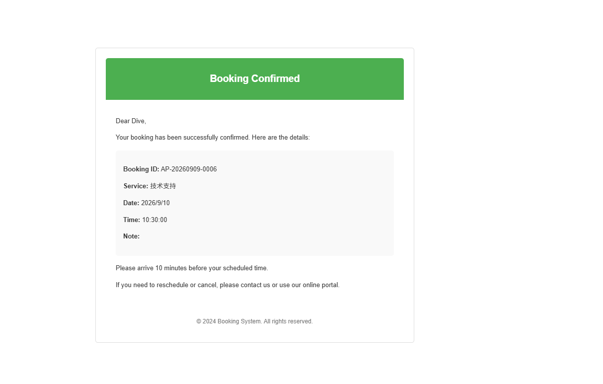
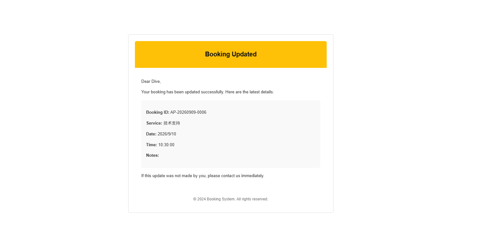
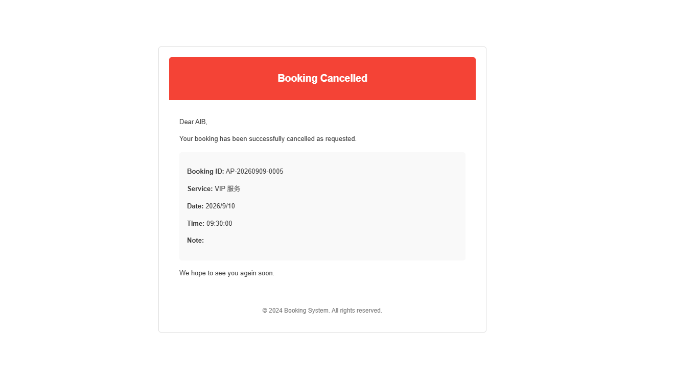

# booking-backend Documentation Index

## About

- **Purpose**: Shows the role of every document under `docs/` and the recommended reading order on a single page.

## Screen Gallery

### Email notification templates

Rendered examples of the HTML emails sent when a booking is confirmed, updated, or cancelled.

**Booking Confirmed**

**Booking Updated**

**Booking Cancelled**

## Recommended reading order

| # | Document | Description |
|---|---|---|
| 1 | [api-contract.md](./docs/api-contract.md) | Endpoint-level API contract. Single source of truth for front/back integration (server-to-server IF-01/IF-02 out of scope). |
| 2 | [sequence-diagrams/01–05](./docs/sequence-diagrams/) | All 43 business scenarios covered by 5 mermaid sequence diagrams (scenario matrix + code anchors). |
| 3 | [scenario-deep-dive.md](./docs/scenario-deep-dive.md) | Deep dives into 3 representative conflict/authorization scenarios (P2034 retry / P2034 exhaustion + P2002 / not-owner cancel 404), with processing flows, code evidence, and verification commands. |
| 4 | [redis-usage-and-schema.md](./docs/redis-usage-and-schema.md) | Redis connection, key schema, and per-use details (token blacklist / SMS verification code / health check). |
| 5 | [manual-retry-procedure.md](./docs/manual-retry-procedure.md) | Runbook for manually retrying failed or stuck Salesforce integration commands (IF-02) and projections (IF-01). |

## Sequence diagram structure

All 43 business scenarios are covered by 5 sequence diagrams. Each diagram consists of a "business scenario list + per-scenario walkthrough + participant evidence (code anchors)".

| Diagram | Flow | Scenarios |
|---|---|---|
| [01](./docs/sequence-diagrams/01-authentication-login-register.md) | Authentication (send-code / login / register → JWT issuance) | 7 |
| [02](./docs/sequence-diagrams/02-service-timeslot-discovery.md) | Service & time-slot discovery (3 GET flows and state composition) | 6 |
| [03](./docs/sequence-diagrams/03-booking-creation.md) | Booking creation (POST /bookings, Serializable transaction) | 10 |
| [04](./docs/sequence-diagrams/04-booking-cancellation.md) | Booking cancellation (PATCH /bookings/:id/cancel) | 8 |
| [05](./docs/sequence-diagrams/05-jwt-guard-token-refresh.md) | JWT guard + axios 401 auto-refresh | 12 |
| **Total** | — | **43** |

## Related repository

- Frontend: [booking-frontend](https://github.com/Cho-Geer/booking-frontend) (React + Redux + axios)

## Documentation conventions

- `.gitignore` ignores `docs/` by default; documents to be version-controlled must be added to the `!/docs/...` whitelist.
- file:line anchors are measured with `grep -n` at a specific commit and re-measured after source changes (line numbers are never copied over from older documents).
- Error message literals in source code are quoted in Chinese without translation, annotated with (※ code literal) where needed.

---

🌍 [日本語](./README.md) | English | [中文](./README.zh.md)
