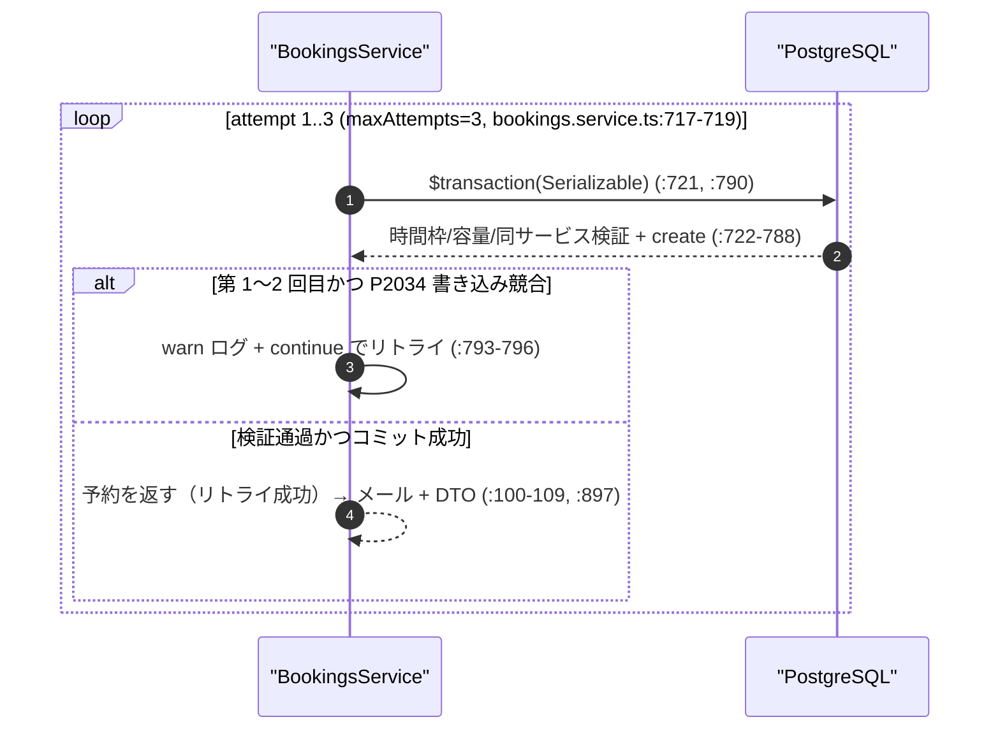
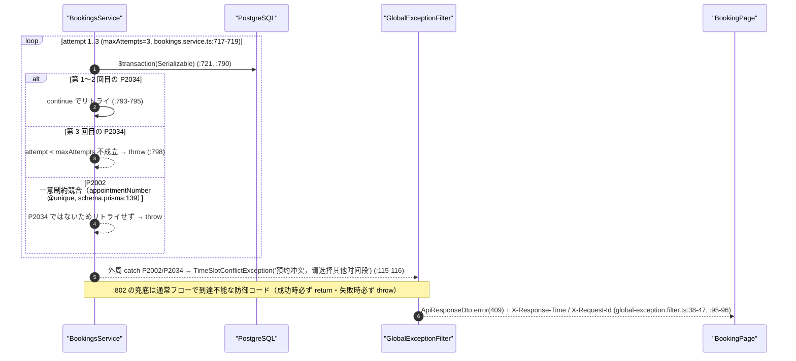
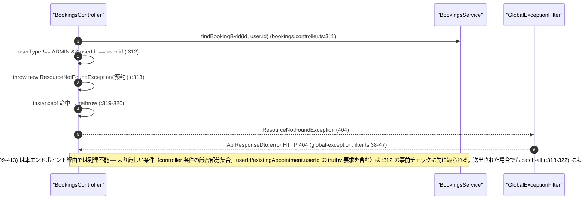

# 予約競合・認可シナリオ深掘り（scenario-deep-dive）

## ドキュメント情報

- **タイトル**: 予約競合・認可シナリオ深掘り（P2034 再試行成功 / P2034 枯渇・P2002 一意制約 / 非所有者キャンセル 404）
- **目的**: 予約作成・キャンセルにおける競合系・認可系の代表シナリオ 3 件について、処理フロー・mermaid 図・コード根拠・検証コマンド付きで深掘りする。
- **関連文書**: 全 43 シナリオの網羅一覧は docs/sequence-diagrams/01〜05 の業務シナリオ一覧を参照。

## シナリオ早見表

| シナリオ | 深掘りポイント | 主な技術要素 |
|---|---|---|
| P2034 再試行成功（第1章） | Serializable トランザクションの書き込み競合からの自動リトライと成功 | maxAttempts=3 ループ・P2034 判定 + continue |
| P2034 枯渇 / P2002 競合（第2章） | 予約作成の最終失敗 2 経路と兜底の到達不能性 | `appointmentNumber @unique`・外周 catch による 409 統一変換 |
| 非所有者キャンセル 404（第3章） | controller/service の認可判定の差とクライアントの観測結果 | 認可判定の厳密部分集合 + userId NULLable・catch-all 404 変換 |

## 第1章 P2034 直列化競合からのリトライ成功（境界系）

03 のシーケンス図 :69-71 に対応。本シナリオは、Serializable トランザクションが並行書き込み競合（Prisma P2034、Transaction failed due to a write conflict）を検出して自動リトライし成功する経路を扱う。`createBookingInSerializableTransaction` は `maxAttempts = 3` でトランザクションをループ実行し（bookings.service.ts:717-719）、第 1〜2 回目の試行で P2034 を捕捉した場合は warn ログを記録して `continue` で次の試行へ進み（:793-796）、リトライ成功後は通常どおり作成結果を返す。リトライ中のトランザクション内の時間枠/容量/同サービス検証（03 のシナリオ 6〜8）は最新データに基づき再実行されるため、並行コミット後の状態を正しく反映する。

### 処理フロー
1. リトライループへ進入: `for (let attempt = 1; attempt <= maxAttempts; attempt++)`、`maxAttempts = 3`（bookings.service.ts:717-719）。
2. 第 1 回目の試行: `prisma.$transaction(async (tx) => {...}, { isolationLevel: Prisma.TransactionIsolationLevel.Serializable })`（bookings.service.ts:721、:790）。トランザクション内で時間枠検証（:722-732）、容量検証（:734-747）、同サービス検証（:750-763）、`tx.appointment.create`（:766-788）を実行する。
3. 並行競合: 別トランザクションが同時にコミットしたことにより本トランザクションのコミット段階で書き込み競合が発生し、Prisma が code=P2034 の例外を送出する。
4. 捕捉判定: `catch (error)` 内で `getPrismaErrorCode(error) === 'P2034' && attempt < maxAttempts` が成立し（bookings.service.ts:793）、`预约创建遇到串行化冲突，正在重试 (attempt/3)`（※コード内のメッセージ literal）を warn 記録し（:794）、`continue` する（:795）。
5. 第 2 回（または第 3 回）目の試行: トランザクションコールバック全体を再実行し、各検証は最新のコミット済みデータに基づく。この時点で並行予約はコミット済みのため、容量/同サービス検証を通過すれば `tx.appointment.create` が成功しトランザクションがコミットされる。
6. 成功返却: createBooking は確認メールを非同期起動し（:100-109）、mapToResponseDto でマスク処理した上で（:897。isOwner 判定 :918）、HTTP 201 を返す（bookings.controller.ts:62-63、:82-83）。途中例外は発生せず、外周 catch（bookings.service.ts:112-125）には進まない。



### コード根拠
| コード要素（関数/例外クラス/フロント呼出） | 作用（コード実読による一文） | 根拠（file:line） |
|---|---|---|
| maxAttempts = 3 | 直列化競合の最大リトライ回数 | `src/modules/bookings/bookings.service.ts:717` |
| リトライループ | attempt 1..maxAttempts | `src/modules/bookings/bookings.service.ts:719` |
| $transaction + Serializable | 直列化可能隔離レベルのトランザクション | `src/modules/bookings/bookings.service.ts:721`、`:790` |
| P2034 判定 + continue | 競合かつ未枯渇のとき warn を記録してリトライ | `src/modules/bookings/bookings.service.ts:793-796` |
| getPrismaErrorCode | 例外オブジェクトから Prisma の code 文字列を抽出 | `src/modules/bookings/bookings.service.ts:805-812` |
| リトライ成功の後続 | メール非同期 + DTO マッピング + 201 | `src/modules/bookings/bookings.service.ts:100-109`、`:897`、`src/modules/bookings/bookings.controller.ts:62-63`、`:82-83` |

### 検証コマンド
```
検証コマンド: grep -n 'const maxAttempts = 3\|for (let attempt = 1\|return await this.prisma.$transaction\|isolationLevel: Prisma.TransactionIsolationLevel.Serializable' src/modules/bookings/bookings.service.ts
717:    const maxAttempts = 3;
719:    for (let attempt = 1; attempt <= maxAttempts; attempt++) {
721:        return await this.prisma.$transaction(async (tx) => {
790:          isolationLevel: Prisma.TransactionIsolationLevel.Serializable,
検証コマンド: awk 'NR>=793 && NR<=802 {print NR": "$0}' src/modules/bookings/bookings.service.ts
793:         if (this.getPrismaErrorCode(error) === 'P2034' && attempt < maxAttempts) {
794:           this.logger.warn(`预约创建遇到串行化冲突，正在重试 (${attempt}/${maxAttempts})`);
795:           continue;
796:         }
797: 
798:         throw error;
799:       }
800:     }
801: 
802:     throw new TimeSlotConflictException('预约冲突，请选择其他时间段');
```

## 第2章 P2034 リトライ枯渇または P2002 一意制約競合（失敗系）

03 のシーケンス図 :73-74 に対応。予約作成の最終失敗となる 2 系統の競合を扱う。(A) 第 3 回目の試行でも P2034 直列化書き込み競合が発生した場合 — `attempt < maxAttempts` が成立せず continue せず、:798 で直接 `throw error` として上位へ送出する（bookings.service.ts:793-796、:798）。:802 の兜底はループ正常終了後の位置にあり、ループ内 `$transaction` は成功時必ず return・失敗時必ず throw に到達するため、通常フローで到達不能な防御コードである（03 のシナリオ 10 の記述と整合）。(B) 任意の試行で `tx.appointment.create` が P2002 一意制約競合を起こす場合。両者とも createBooking の外周 catch で識別され（bookings.service.ts:115-116）、`TimeSlotConflictException('预约冲突，请选择其他时间段')`（※コード内のメッセージ literal。HTTP 409、business.exceptions.ts:116-118）へ統一変換される。P2002 一意制約の発生源は `Appointment.appointmentNumber @unique`（schema.prisma:139）である — 番号は当日 count+1 で生成するため（bookings.service.ts:874-889）、並行実行時に同一番号が生成され、後コミット側が一意制約で失敗し得る（この発生源はコード調査により補完。図 :73 は P2002 の語のみ言及）。

### 処理フロー
1. 分岐 A — P2034 リトライ枯渇: 第 3 回目の試行で P2034 が送出され、`getPrismaErrorCode(error) === 'P2034' && attempt < maxAttempts` の `attempt(3) < maxAttempts(3)` が成立しない（bookings.service.ts:793）→ continue せず、:798 で直接 `throw error` として上位へ送出する。
2. 分岐 B — ループ後の兜底: ループ内 `$transaction` は成功時必ず `return`（:721-791）、失敗時必ず catch 内 `throw`（:792-799）で終了するため、:802 の `throw new TimeSlotConflictException('预约冲突，请选择其他时间段')` は通常フローで到達不能であり、防御コードである（理論上、ループ本体が return も throw もしない形で終了した場合にのみ実行され得る）。
3. 分岐 C — P2002 一意制約: `tx.appointment.create`（bookings.service.ts:766-788）が書き込む `appointmentNumber` が `@unique` インデックスに抵触する（schema.prisma:139）→ Prisma が code=P2002 を送出 → P2034 ではないためリトライ分岐に入らず（:793 の条件不成立）→ 上位へ送出される。
4. 外周 catch: `getPrismaErrorCode(error)` が 'P2002' または 'P2034' のとき `TimeSlotConflictException('预约冲突，请选择其他时间段')` を送出する（bookings.service.ts:115-116）。
5. GlobalExceptionFilter: `ApiResponseDto.error(409, ...)` と X-Response-Time / X-Request-Id ヘッダへ変換する（global-exception.filter.ts:38-47、:95-96）。
6. フロント: メッセージ '预约冲突，请选择其他时间段' は '时间段已满' の専用分岐に一致しないため（`booking-frontend/src/components/pages/BookingPage.tsx:345-364`）、汎用失敗分岐 `showError('预约创建失败', ...)`（BookingPage.tsx:365）へ進む。



### コード根拠
| コード要素（関数/例外クラス/フィルタ/フロント呼出） | 作用（コード実読による一文） | 根拠（file:line） |
|---|---|---|
| P2034 リトライ枯渇 | 第 3 回の競合で `attempt < maxAttempts` 不成立、`:798` で直接 throw error | `src/modules/bookings/bookings.service.ts:793-799` |
| ループ後の兜底（防御コード） | 成功時必ず return・失敗時必ず throw、`:802` は通常フローで到達不能 | `src/modules/bookings/bookings.service.ts:802` |
| tx.appointment.create | appointmentNumber 等のフィールドを書き込む | `src/modules/bookings/bookings.service.ts:766-788` |
| appointmentNumber @unique | P2002 一意制約の発生源（番号生成の競態） | `prisma/schema.prisma:139` |
| 番号生成 | 当日 count+1（`startsWith AP-日付-`） | `src/modules/bookings/bookings.service.ts:874-889` |
| 外周 catch P2002/P2034 | `TimeSlotConflictException('预约冲突，请选择其他时间段')` へ統一変換 | `src/modules/bookings/bookings.service.ts:115-116` |
| TimeSlotConflictException | HTTP 409 | `src/common/exceptions/business.exceptions.ts:116-118` |
| GlobalExceptionFilter | BusinessException → ApiResponseDto.error + レスポンスヘッダ | `src/common/filters/global-exception.filter.ts:38-47`、`:95-96` |
| フロント汎用失敗分岐 | '时间段已满' 以外のメッセージは汎用 showError へ | `booking-frontend/src/components/pages/BookingPage.tsx:365` |

### 検証コマンド
```
検証コマンド: awk 'NR>=112 && NR<=117 {print NR": "$0}' src/modules/bookings/bookings.service.ts
112:     } catch (error) {
113:       const prismaErrorCode = this.getPrismaErrorCode(error);
114: 
115:       if (prismaErrorCode === 'P2002' || prismaErrorCode === 'P2034') {
116:         throw new TimeSlotConflictException('预约冲突，请选择其他时间段');
117:       }
検証コマンド: grep -n "appointmentNumber   String            @unique" prisma/schema.prisma
139:  appointmentNumber   String            @unique @db.VarChar(20) // AP-yyyymmdd-0001格式
```

## 第3章 非所有者（非管理者）による他人の予約取消は 404（失敗系）

04 のシーケンス図 :48-50、注 :58 に対応。予約所有者でも管理者でもないユーザーが他人の予約のキャンセルを試みる失敗経路を扱う。controller の事前チェック `user.userType !== UserType.ADMIN && existingBooking.userId !== user.id` が命中すると `ResourceNotFoundException('预约')`（※コード内のメッセージ literal）を送出し（bookings.controller.ts:312-314）、rethrow 後に GlobalExceptionFilter が HTTP 404 へ変換する — これがクライアントが実際に観測するレスポンスである。service 層には条件がより厳しい `AuthorizationException('无权取消此预约')`（※コード内のメッセージ literal。bookings.service.ts:409-413。例外クラスの状態コード 403 は business.exceptions.ts:66-69）が存在する — service の条件（:410-411）は controller の条件（:312）の**厳密部分集合**であり、`userId` と `existingAppointment.userId` がともに truthy であることを追加で要求する。Appointment.userId は可空（schema.prisma:140）のため、予約の userId が null の場合は両条件の結果が異なる（controller 条件は依然として発火し、service 条件は発火しない）。当該分岐は本エンドポイント経由では到達不能である: controller は service 呼出前に自条件で 404 を送出済みであり（04 図注 :58 に記載のとおり）、到達した場合でも controller の catch-all（bookings.controller.ts:318-322）が `ResourceNotFoundException('预约')` へ変換する。注: 非所有者シナリオでクライアントが受け取るのは 403 ではなく 404 である。

### 処理フロー
1. controller 事前チェック: `findBookingById(id, user.id)` が `existingBooking` を返す（bookings.controller.ts:311。service 定義 bookings.service.ts:134）。
2. 権限判定: `if (user.userType !== UserType.ADMIN && existingBooking.userId !== user.id)`（bookings.controller.ts:312）— ADMIN でなく、かつ予約の userId ≠ 現ユーザー id のときに命中する。
3. 例外送出: `throw new ResourceNotFoundException('预约')`（bookings.controller.ts:313）→ catch の instanceof 命中により rethrow（:319-320）。
4. GlobalExceptionFilter: `ApiResponseDto.error` の HTTP 404 へ変換する（global-exception.filter.ts:38-47）。レスポンスには X-Response-Time / X-Request-Id ヘッダを付与する（:95-96）。
5. 到達可能性: service `cancelBooking` の権限分岐 `userId && existingAppointment.userId && existingAppointment.userId !== userId && userType !== UserType.ADMIN`（bookings.service.ts:410-411）は controller 条件（:312）の**厳密部分集合**である — `userId`（controller は `user.id` を渡す。:316。常に truthy）と `existingAppointment.userId`（Appointment.userId は可空。schema.prisma:140）の両方が truthy であることを追加で要求する。予約の userId が null でも controller 条件は発火し得るが（`null !== user.id`）、service 条件は発火しない。ステップ 2 が先に遮るため当該分岐は本エンドポイント経由では到達不能であり、それでも `AuthorizationException('无权取消此预约')`（:412）が送出された場合は service catch が rethrow し（:463-467）、その後 controller の catch-all（:318-322。ResourceNotFoundException 以外は一律 `ResourceNotFoundException('预约')` へ変換）により 404 へ変換される。



### コード根拠
| コード要素（関数/守備/例外クラス/フィルタ） | 作用（コード実読による一文） | 根拠（file:line） |
|---|---|---|
| controller 権限検証 | ADMIN でなく予約本人でもない → ResourceNotFoundException('预约') | `src/modules/bookings/bookings.controller.ts:312-314`（`:312`/`:313`） |
| service AuthorizationException 分岐 | より厳しい条件（controller 条件の厳密部分集合。userId/existingAppointment.userId の truthy 要求を含む）で AuthorizationException('无权取消此预约')。本エンドポイントでは到達不能 | `src/modules/bookings/bookings.service.ts:409-413`（`:410-411`/`:412`） |
| AuthorizationException | 状態コード HttpStatus.FORBIDDEN（403） | `src/common/exceptions/business.exceptions.ts:66-69`（`:68`） |
| controller catch-all | ResourceNotFoundException 以外は一律 ResourceNotFoundException('预约') へ変換 | `src/modules/bookings/bookings.controller.ts:318-322`（`:319`/`:322`） |
| controller 呼出引数 | cancelBooking(id, user.id, user.userType, user.id) — userId は現ユーザー | `src/modules/bookings/bookings.controller.ts:316` |
| GlobalExceptionFilter | BusinessException → ApiResponseDto.error + レスポンスヘッダ | `src/common/filters/global-exception.filter.ts:22`、`:38-47`、`:95-96` |

### 検証コマンド
```
検証コマンド: awk 'NR>=311 && NR<=316 {print NR": "$0}' src/modules/bookings/bookings.controller.ts
311:       const existingBooking = await this.bookingsService.findBookingById(id, user.id);
312:       if (user.userType !== UserType.ADMIN && existingBooking.userId !== user.id) {
313:         throw new ResourceNotFoundException('预约');
314:       }
315:       
316:       await this.bookingsService.cancelBooking(id, user.id, user.userType, user.id);
検証コマンド: awk 'NR>=409 && NR<=413 {print NR": "$0}' src/modules/bookings/bookings.service.ts
409:       // 权限检查：只有预约者本人或管理员可以取消
410:       if (userId && existingAppointment.userId && existingAppointment.userId !== userId 
411:         && userType !== UserType.ADMIN) {
412:         throw new AuthorizationException('无权取消此预约');
413:       }
検証コマンド: awk 'NR>=66 && NR<=69 {print NR": "$0}' src/common/exceptions/business.exceptions.ts
66: export class AuthorizationException extends BusinessException {
67:   constructor(message = '权限不足', details?: any) {
68:     super('AUTHORIZATION_ERROR', message, HttpStatus.FORBIDDEN, details);
69:   }
```
