# 01 - 認証フロー（Authentication: send-code / login / register -> JWT 発行）

## ドキュメント情報

- **タイトル**: 認証フロー（send-code / login / register → JWT 発行）

- **目的**: 認証モジュール（検証コード送信 / ログイン / 登録）におけるリクエスト処理パイプライン・JWT 発行・Cookie 設定・例外ハンドリングの全経路を、コード根拠付きのシーケンス図として示す。

```mermaid
sequenceDiagram
    autonumber
    participant Browser as "ブラウザ (LoginForm / RegisterForm)"
    participant userSlice as "userSlice (Redux thunks)"
    participant userApi as "userApi (frontend)"
    participant axios as "axios api (インターセプター)"
    participant CsrfMiddleware as "CsrfMiddleware (CSRF ダブルサブミット Cookie)"
    participant JwtAuthGuard as "JwtAuthGuard (グローバル APP_GUARD)"
    participant AuthController as "AuthController (NestJS)"
    participant AuthService as "AuthService"
    participant UsersService as "UsersService"
    participant JwtService as "JwtService (@nestjs/jwt)"
    participant Redis as "Redis Cache (cache-manager)"
    participant PostgreSQL as "PostgreSQL (Prisma)"
    participant TransformInterceptor as "TransformInterceptor"
    participant GlobalExceptionFilter as "GlobalExceptionFilter"

    Note over Browser, PostgreSQL: ステップ1 検証コード送信 POST /auth/send-verification-code
    Note over axios, AuthController: 注: 認証 4 パス (login/register/send-verification-code/refresh) はすべて csrfBypassPaths 内 (csrf.middleware.ts:5-10)。かつ CSRF ミドルウェアは CSRF_ENABLED=true の場合のみ API_PREFIX にマウントされる (main.ts:65-66) ので、認証リクエストに X-CSRF-Token は不要
    Note over axios, AuthController: 注: NestJS リクエストパイプライン (順序): request-id ミドルウェア (main.ts:13-32, X-Request-Id レスポンスヘッダ設定 + 構造化アクセスログ http_request) → CsrfMiddleware (main.ts:64-67) → グローバル JwtAuthGuard (app.module.ts:91-92) → グローバル ValidationPipe (main.ts:36-45, whitelist + forbidNonWhitelisted + transform) + コントローラ @Body(ValidationPipe) (auth.controller.ts:60/80/100) → TransformInterceptor (auth.controller.ts:40 クラスレベル @UseInterceptors) → Handler
    Note over axios, AuthController: 注: 送出された例外はすべてグローバル GlobalExceptionFilter が捕捉し、ApiResponseDto.error(status, message, error) へ統一変換する (global-exception.filter.ts:22-23, 38-47)。レスポンスには X-Response-Time / X-Request-Id ヘッダを付与 (filter:95-97)
    Browser->>userSlice: 電話番号送信 (LoginForm handleSendCode / RegisterForm handleSendCode)
    userSlice->>userApi: sendCode({ phoneNumber, type })
    userApi->>axios: POST /auth/send-verification-code
    axios->>CsrfMiddleware: POST /v1/auth/send-verification-code (リクエストインターセプターは csrf_token cookie が存在する場合のみ X-CSRF-Token を付与, api.ts:79-95)
    CsrfMiddleware->>JwtAuthGuard: next() 素通し (csrfBypassPaths 命中, csrf.middleware.ts:27-30)
    JwtAuthGuard->>AuthController: 素通し (@SkipJwtAuth() で認証スキップ, jwt-auth.guard.ts:32-35)
    AuthController->>AuthService: sendVerificationCode(phoneNumber, type)
    AuthService->>UsersService: findUserByPhoneNumber(phoneNumber)
    UsersService->>PostgreSQL: user.findUnique({ where: { phoneHash } })
    alt type=REGISTER 且つユーザー既存在
        AuthService-->>GlobalExceptionFilter: PhoneNumberExistsException を送出
        GlobalExceptionFilter-->>Browser: ApiResponseDto.error(...) + X-Response-Time / X-Request-Id ヘッダ (global-exception.filter.ts:38-47, 94-100)
    else type=LOGIN 且つユーザー未存在
        AuthService-->>GlobalExceptionFilter: ResourceNotFoundException を送出
    else type=LOGIN 且つユーザー無効化済み
        AuthService-->>GlobalExceptionFilter: AuthenticationException を送出
    end
    AuthService->>Redis: set verification_code:{phone} = 6桁検証コード, TTL 300秒 (auth.service.ts:552)
    AuthService-->>AuthController: 検証コード生成済み (SMS サービスは TODO, ログ出力のみ, auth.service.ts:250-251)
    AuthController->>TransformInterceptor: ApiResponseDto.success(null) を返す (auth.controller.ts:106)
    TransformInterceptor-->>Browser: ApiResponseDto 透過 + X-Response-Time / X-Request-Id ヘッダ (transform.interceptor.ts:36-41, 48-49)

    alt ログインフロー (POST /auth/login)
        Browser->>userSlice: 電話番号 + 検証コード送信 (LoginPage handleVerifyCode)
        userSlice->>userApi: verifyCode({ phoneNumber, code })
        userApi->>axios: POST /auth/login
        axios->>CsrfMiddleware: POST /v1/auth/login (免除パス, X-CSRF-Token 不要)
        CsrfMiddleware->>JwtAuthGuard: next() 素通し (csrf.middleware.ts:27-30)
        JwtAuthGuard->>AuthController: 素通し (@SkipJwtAuth, auth.controller.ts:53)
        AuthController->>AuthService: login(loginDto)
        AuthService->>Redis: get verification_code:{phone}
        alt 検証コード誤りまたは未存在
            AuthService-->>GlobalExceptionFilter: VerificationCodeException を送出
        else 検証成功
            AuthService->>Redis: del verification_code:{phone} (使い捨て防止, auth.service.ts:529)
        end
        AuthService->>UsersService: findUserByPhoneNumber(phoneNumber)
        UsersService->>PostgreSQL: user.findUnique(phoneHash)
        alt ユーザー未存在
            AuthService-->>GlobalExceptionFilter: ResourceNotFoundException を送出
        else ステータスが非 ACTIVE
            AuthService-->>GlobalExceptionFilter: AuthenticationException を送出
        end
        AuthService->>JwtService: signAsync(payload, JWT_SECRET) で accessToken 生成
        AuthService->>JwtService: signAsync(payload, JWT_REFRESH_SECRET) で refreshToken 生成
        AuthService-->>AuthController: LoginResponseDto (accessToken + refreshToken + user)
        AuthController->>Browser: setAuthCookies で access_token / refresh_token (httpOnly) + csrf_token (httpOnly=false, randomBytes(32) hex) を書き込み (auth.controller.ts:256-271)
        Note over AuthController, Browser: 注: cookie sameSite / secure は動的設定: COOKIE_SAME_SITE=none のとき sameSite=none かつ secure=true、それ以外は sameSite=lax、secure は production のみ true (auth.controller.ts:234-236)
        AuthController->>TransformInterceptor: ApiResponseDto.success(result) を返す (auth.controller.ts:65)
        TransformInterceptor-->>Browser: ApiResponseDto 透過 (code/message 検出時は再ラップしない, transform.interceptor.ts:36-41) + X-Response-Time / X-Request-Id ヘッダ (:38-39, 48-49)
    else 登録フロー (POST /auth/register)
        Browser->>userSlice: 登録フォーム送信 (RegisterPage handleRegister)
        userSlice->>userApi: register(data)
        userApi->>axios: POST /auth/register
        axios->>CsrfMiddleware: POST /v1/auth/register (免除パス, X-CSRF-Token 不要)
        CsrfMiddleware->>JwtAuthGuard: next() 素通し (csrf.middleware.ts:27-30)
        JwtAuthGuard->>AuthController: 素通し (@SkipJwtAuth, auth.controller.ts:74)
        AuthController->>AuthService: register(registerDto)
        AuthService->>Redis: get verification_code:{phone}
        alt 検証コード誤りまたは未存在
            AuthService-->>GlobalExceptionFilter: VerificationCodeException を送出
        else 検証成功
            AuthService->>Redis: del verification_code:{phone} (使い捨て防止) (auth.service.ts:529)
            AuthService->>UsersService: findUserByPhoneNumber(phoneNumber)
            alt 電話番号既存在
                AuthService-->>GlobalExceptionFilter: PhoneNumberExistsException を送出
            else 検証通過
                AuthService->>UsersService: createUser({ name, phone, email, userType: CUSTOMER, status: ACTIVE })
                UsersService->>PostgreSQL: user.findUnique(phoneHash) + user.findUnique(email) 重複防止 + user.create (電話番号マスキング + phoneHash 保存, users.service.ts:50-55, 59-66, 69-80)
                alt メールアドレス既存在
                    UsersService-->>AuthService: EmailExistsException を送出 (users.service.ts:64-66)
                    AuthService-->>GlobalExceptionFilter: EmailExistsException を透過 (auth.service.ts:153-156)
                else 作成成功
                    AuthService->>JwtService: signAsync x2 で accessToken + refreshToken 生成
                    AuthService-->>AuthController: LoginResponseDto
                    AuthController->>Browser: setAuthCookies で access_token / refresh_token / csrf_token を書き込み (auth.controller.ts:256-271)
                    AuthController->>TransformInterceptor: ApiResponseDto.success(result) を返す (HTTP 201, auth.controller.ts:75/85)
                    TransformInterceptor-->>Browser: ApiResponseDto 透過 登録成功 + X-Response-Time / X-Request-Id ヘッダ
                end
            end
        end
    end
```

## ビジネスシナリオ一覧

| # | 分類  | シナリオ                  | トリガー条件                                                                        | HTTP                       | 主要アンカー(file:line)                                                             |
| - | --- | --------------------- | ----------------------------------------------------------------------------- | -------------------------- | ----------------------------------------------------------------------------- |
| 1 | 正常系 | 新規ユーザー登録フロー           | `sendCode(REGISTER)` → ユーザー未存在 → 検証コード照合 → `register` → 重複防止チェック通過 → JWT 二重発行 | 201                        | `auth.service.ts:107-162`、`users.service.ts:47-92`、`auth.controller.ts:73-86` |
| 2 | 正常系 | 既存ユーザーログインフロー         | `sendCode(LOGIN)` → ユーザー存在且つ ACTIVE → `login` → 検証コード照合 → JWT 二重発行            | 200                        | `auth.service.ts:48-100`、`auth.controller.ts:52-66`                           |
| 3 | 失敗系 | 電話番号登録済み（登録前段で拒否）     | `sendCode(REGISTER)` の事前チェックで `findUserByPhoneNumber` がヒット                    | PhoneNumberExistsException | `auth.service.ts:227-231`、`users.service.ts:50-55`                            |
| 4 | 失敗系 | ユーザー未存在（ログイン失敗）       | `sendCode(LOGIN)` / `login` でユーザー無し                                           | ResourceNotFoundException  | `auth.service.ts:232-237`、`auth.service.ts:61-65`                             |
| 5 | 失敗系 | ユーザー無効化済み             | status が非 ACTIVE                                                              | AuthenticationException    | `auth.service.ts:238-241`、`auth.service.ts:67-70`                             |
| 6 | 失敗系 | 検証コード誤り / 期限切れ / 使用済み | Redis に対象キー無し、または入力不一致                                                        | VerificationCodeException  | `auth.service.ts:513-532`                                                     |
| 7 | 失敗系 | メールアドレス使用済み（登録失敗）     | `register` の email 重複チェックでヒット                                                 | EmailExistsException       | `users.service.ts:59-66`                                                      |

> 注: 例外クラスの HTTP ステータスは `src/common/exceptions/business.exceptions.ts` の実測値（AuthenticationException=401 `:50`、ResourceNotFoundException=404 `:77`、PhoneNumberExistsException=409 `:136`、EmailExistsException=409 `:154`、VerificationCodeException=400 `:172`）。

> 本シーケンス図の alt/else 分岐と参加者インタラクションから帰納したもので、正常系と失敗系の 2 分類で認証モジュールの全業務経路を網羅する。

### 1. 新規ユーザー登録フロー（正常系）

`sendCode(REGISTER)` → ユーザー未存在且つ無効化されていない → 検証コードを Redis に書き込み（`verification_code:{phone}`、TTL 300s）→ ユーザーが検証コード入力 → `register` → 検証コード照合成功後に削除（リプレイ防止）→ 電話番号重複防止 → メール重複防止 → `prisma.user.create`（userType: CUSTOMER, status: ACTIVE、電話番号マスキング + phoneHash 保存）→ JWT 二重発行 → `setAuthCookies` で 3 個の Cookie 書き込み → HTTP 201 返却。

### 2. 既存ユーザーログインフロー（正常系）

`sendCode(LOGIN)` → ユーザー存在且つステータス ACTIVE → `login` → 検証コード照合成功後に削除 → JWT 二重発行 → access\_token / refresh\_token / csrf\_token 書き込み → HTTP 200 返却。

### 3. 電話番号登録済み（登録前段で拒否）

`sendCode(REGISTER)` の事前チェック段階で `findUserByPhoneNumber` がヒット → `PhoneNumberExistsException` を送出 → GlobalExceptionFilter がエラーレスポンスを返す。さらに `register` 段階でも二次の重複チェックを行い、二重防御を構成する。

### 4. ユーザー未存在（ログイン失敗）

`sendCode(LOGIN)` 段階でユーザー未存在 → `ResourceNotFoundException`。`login` 段階でも同様に送出する。設計上は「ユーザー未存在」と「検証コード誤り」を区別せず、電話番号の列挙（enumeration）を防ぐ。

### 5. ユーザー無効化

ユーザー status が非 ACTIVE の場合、`sendCode(LOGIN)` と `login` の両段階で `AuthenticationException` を送出する。無効化ユーザーは検証コード受信もログインも不可。

### 6. 検証コード誤り / 期限切れ / 使用済み

Redis に対応する検証コードが無い（期限切れ・未送信・消費済み）か、入力が一致しない → `VerificationCodeException`。検証コードは照合成功直後に `del` され、一度きりの消費でリプレイ攻撃を防ぐ。

### 7. メールアドレス使用済み（登録失敗）

`register` の作成前に email 重複チェックがヒット → `EmailExistsException`、AuthService が透過 → GlobalExceptionFilter → エラーレスポンス。電話番号重複チェックと合わせて、作成前の二重ユニーク制約を構成する。

### シナリオ共通（不変条件）

- 認証 4 エンドポイント（login / register / send-verification-code / refresh）はいずれも `csrfBypassPaths` に命中し、かつ `@SkipJwtAuth()` を持つ。すなわち二重免除で、未ログイン状態で到達可能。

- 検証コードは一様に `verification_code:{phone}` に保存、TTL 300 秒、一回限りの消費。

- 成功パスは一様に TransformInterceptor で `ApiResponseDto.success` にラップ/透過され、失敗パスは一様に GlobalExceptionFilter が `ApiResponseDto.error` を出力する。いずれも X-Response-Time / X-Request-Id レスポンスヘッダを付与する。

- ログイン/登録成功後は 3 個の Cookie を書き込む: access\_token / refresh\_token（httpOnly）+ csrf\_token（httpOnly=false、randomBytes(32) hex）。sameSite/secure は COOKIE\_SAME\_SITE により動的に決まる。

## Participant evidence（コード根拠）

| participant                      | file\_path:line\_number 根拠                                                                                                                                                                                                                                                                                                              |
| -------------------------------- | --------------------------------------------------------------------------------------------------------------------------------------------------------------------------------------------------------------------------------------------------------------------------------------------------------------------------------------- |
| Browser (LoginForm/RegisterForm) | `booking-frontend/src/components/molecules/LoginForm.tsx:46`（コンポーネント定義）、`RegisterForm.tsx:67`。ページ配線 `booking-frontend/src/components/pages/LoginPage.tsx:43-53`、`RegisterPage.tsx:41-52`                                                                                                                                                |
| userSlice                        | `booking-frontend/src/store/userSlice.ts:52`（registerUser）、`:63`（sendCode）、`:74`（verifyCode）                                                                                                                                                                                                                                            |
| userApi                          | `booking-frontend/src/services/userApi.ts:13`。`/auth/register` `:20`、`/auth/send-verification-code` `:36`、`/auth/login` `:47`                                                                                                                                                                                                           |
| axios api                        | `booking-frontend/src/services/api.ts:13`（axios.create）、`:16`（withCredentials）、`:79-95`（リクエストインターセプター: POST/PUT/PATCH/DELETE かつ csrf\_token cookie 存在時のみ X-CSRF-Token 付与）、`:100-281`（応答インターセプター, 401 自動リフレッシュ含む）                                                                                                                        |
| CsrfMiddleware                   | `src/common/middleware/csrf.middleware.ts:21`（ミドルウェア入口）、`:4`（unsafeMethods）、`:5-10`（4 免除パス）、`:22-25`（safe method 素通し）、`:33-37`（Bearer ヘッダ免除）、`:39-49`（ダブルサブミット timingSafeEqual 比対 + 403）。マウント条件 `src/main.ts:64-67`（CSRF\_ENABLED=true 時 app.use(API\_PREFIX, ...)）                                                                     |
| JwtAuthGuard                     | `src/app.module.ts:91-92`（APP\_GUARD グローバル登録）。`src/common/guards/jwt-auth.guard.ts:32-35`（skipJwtAuth リフレクション素通し）。`auth.controller.ts:53/74/94/115`（@SkipJwtAuth）                                                                                                                                                                       |
| AuthService                      | `src/modules/auth/auth.service.ts:32`。`login` `:48`、`register` `:107`、`sendVerificationCode` `:221`、`generateTokens` `:418`、`validateVerificationCode` `:513`、`saveVerificationCode` `:547`                                                                                                                                             |
| UsersService                     | `src/modules/users/users.service.ts:29`。`createUser` `:47`（phoneHash 重複防止 `:50-55`、email 重複防止 `:59-66`、create `:70`）、`findUserByPhoneNumber` `:138`、`findUserByPhoneHash` `:125`                                                                                                                                                        |
| JwtService                       | `src/modules/auth/auth.service.ts:440,444`（signAsync）。`src/app.module.ts:59-69`（JwtModule.registerAsync, global: true）                                                                                                                                                                                                                  |
| Redis Cache                      | `src/app.module.ts:44-56`（CacheModule.registerAsync redisStore）。`auth.service.ts:518`（get）、`:529`（del）、`:552`（set TTL 300s）                                                                                                                                                                                                             |
| PostgreSQL                       | `src/modules/users/users.service.ts:126-128`（findUnique）、`:70`（create）。`prisma/schema.prisma:56`（User model）                                                                                                                                                                                                                            |
| TransformInterceptor             | `src/common/interceptors/transform.interceptor.ts:21`。ApiResponseDto 透過 `:36-41`、レスポンスヘッダ `:38-39`/`:48-49`。マウント点 `auth.controller.ts:40`（クラスレベル @UseInterceptors）                                                                                                                                                                      |
| GlobalExceptionFilter            | `src/main.ts:33`（useGlobalFilters）。`src/common/filters/global-exception.filter.ts:22-23`（@Catch() 全捕捉）、BusinessException → ApiResponseDto.error `:38-47`、レスポンスヘッダ `:95-97`                                                                                                                                                              |
