# 02 - サービス・時間枠発見フロー（Service & Time-slot discovery）

## ドキュメント情報

- **タイトル**: サービス・時間枠発見フロー（サービス一覧取得 / 空き時間枠取得 / 当日予約の補助照会）

- **目的**: 予約ページ（BookingPage）が利用する 3 つの GET リクエストフロー（`GET /v1/services`、`GET /v1/time-slots/available-slots`、`GET /v1/bookings/by-date`）について、リクエストパイプライン・ガードチェーンの差異・per-slot 空き状況計算・フロントエンドでの状態合成までを、コード根拠付きのシーケンス図として示す。

```mermaid
sequenceDiagram
    autonumber
    participant BookingPage as "BookingPage (ページコンテナ)"
    participant serviceSlice as "serviceSlice (Redux)"
    participant serviceApi as "serviceApi"
    participant slotTimeSlice as "slotTimeSlice (Redux)"
    participant slotTimeApi as "slotTimeApi"
    participant axios as "axios api (インターセプター)"
    participant CsrfMiddleware as "CsrfMiddleware (CSRF ダブルサブミット Cookie)"
    participant JwtAuthGuard as "JwtAuthGuard (グローバル APP_GUARD)"
    participant RolesGuard as "RolesGuard (ロール検証)"
    participant ServicesController as "ServicesController (NestJS)"
    participant ServicesService as "ServicesService"
    participant TimeSlotsController as "TimeSlotsController (NestJS)"
    participant TimeSlotsService as "TimeSlotsService"
    participant PostgreSQL as "PostgreSQL (Prisma)"
    participant TransformInterceptor as "TransformInterceptor"
    participant GlobalExceptionFilter as "GlobalExceptionFilter"

    Note over BookingPage, PostgreSQL: サービス一覧 GET /v1/services (有効サービスのみ)
    Note over axios, ServicesController: 注: NestJS リクエストパイプライン (順序): request-id ミドルウェア (main.ts:13-32, X-Request-Id レスポンスヘッダ設定 + 構造化アクセスログ http_request) → CsrfMiddleware (main.ts:65-66, CSRF_ENABLED=true の場合のみ API_PREFIX にマウント) → グローバル JwtAuthGuard (app.module.ts:91-92) → グローバル ValidationPipe (main.ts:36-45) → TransformInterceptor (services.controller.ts:17) → Handler
    Note over axios, ServicesController: 注: GET は safe method のため CsrfMiddleware は X-CSRF-Token 無しで素通しする (csrf.middleware.ts:22-25). GET /v1/services はグローバル JwtAuthGuard で保護 — ServicesController はクラスレベル @UseGuards(RolesGuard) (services.controller.ts:16), findAll に @Roles 注記は無く RolesGuard は任意の認証済みユーザーを通過させる (roles.guard.ts:29-34). ガードチェーン詳細は 05 参照. 下段の保護なし GET /time-slots/available-slots (TimeSlotsController はクラスレベルガード無し かつ @SkipJwtAuth, time-slots.controller.ts:60) とは異なる
    Note over axios, GlobalExceptionFilter: 注: コントローラ/サービスが送出する例外はすべてグローバル GlobalExceptionFilter が捕捉し ApiResponseDto.error(status, message, error) へ統一変換する (global-exception.filter.ts:22-23, 38-47)。レスポンスには X-Response-Time / X-Request-Id ヘッダを付与 (filter:95-97)
    BookingPage->>serviceSlice: dispatch(fetchServicesForUsers()) (マウント時に先に dispatch(clearServices()) で停止済みサービスを含むキャッシュをクリア, BookingPage.tsx:130-131)
    serviceSlice->>serviceApi: getServicesForCustomers(query)
    serviceApi->>axios: GET /services
    axios->>CsrfMiddleware: GET /v1/services (safe method, X-CSRF-Token 不要)
    CsrfMiddleware->>JwtAuthGuard: next() 素通し (csrf.middleware.ts:22-25)
    JwtAuthGuard->>JwtAuthGuard: verifyAsync + user.findUnique 検証 (jwt-auth.guard.ts:117, 147)
    JwtAuthGuard->>RolesGuard: 認証通過, request.user 注入済み
    RolesGuard->>ServicesController: 素通し (findAll に @Roles 無し, roles.guard.ts:32-34)
    ServicesController->>ServicesService: findAll()
    ServicesService->>PostgreSQL: service.findMany({ where: { isActive: true }, orderBy: displayOrder, include: category })
    ServicesService-->>ServicesController: 有効サービス一覧
    ServicesController->>TransformInterceptor: ApiResponseDto.success を返す (services.controller.ts:29)
    TransformInterceptor-->>axios: ApiResponseDto 透過 + X-Response-Time / X-Request-Id ヘッダ (transform.interceptor.ts:36-41, 48-49)
    axios-->>serviceApi: サービス配列
    serviceApi-->>serviceSlice: Service[]
    serviceSlice-->>BookingPage: state.services (fulfilled)

    Note over BookingPage, PostgreSQL: 空き時間枠 GET /v1/time-slots/available-slots?date=YYYY-MM-DD
    Note over axios, TimeSlotsController: 注: このエンドポイントは @SkipJwtAuth (time-slots.controller.ts:60) でグローバル JwtAuthGuard が素通し (jwt-auth.guard.ts:32-35), TimeSlotsController にクラスレベル RolesGuard は無い. GET safe method のため CSRF も免除 (csrf.middleware.ts:22-25)
    BookingPage->>slotTimeSlice: dispatch(getAvailableSlots(selectedDate)) (マウント時は本日日付, 日付切替時に再ディスパッチ)
    slotTimeSlice->>slotTimeApi: getAvailableSlots(date)
    slotTimeApi->>axios: GET /time-slots/available-slots (params: { date })
    axios->>CsrfMiddleware: GET /v1/time-slots/available-slots?date=YYYY-MM-DD (safe method 素通し)
    CsrfMiddleware->>JwtAuthGuard: next() (csrf.middleware.ts:22-25)
    JwtAuthGuard->>TimeSlotsController: 素通し (@SkipJwtAuth, jwt-auth.guard.ts:32-35)
    TimeSlotsController->>TimeSlotsService: getAvailability({ date })
    TimeSlotsService->>PostgreSQL: timeSlot.findMany({ where: { isActive: true }, orderBy: { slotTime: 'asc' } })
    loop 有効な各時間枠 slot に対して
        TimeSlotsService->>PostgreSQL: appointment.count({ timeSlotId, appointmentDate: date, status != CANCELLED })
        TimeSlotsService-->>TimeSlotsService: availableCount = maxCapacity(1) - bookedCount, isAvailable = availableCount > 0 && slot.isActive
    end
    TimeSlotsService-->>TimeSlotsController: 空き状況リスト (bookedCount / availabilityStatus 含む)
    TimeSlotsController->>TransformInterceptor: ApiResponseDto.success を返す (time-slots.controller.ts:67)
    TransformInterceptor-->>axios: ApiResponseDto 透過 + X-Response-Time / X-Request-Id ヘッダ
    axios-->>slotTimeApi: 空き状況配列
    slotTimeApi-->>slotTimeSlice: TimeSlot[] (startTime / endTime / available へ写像)
    slotTimeSlice-->>BookingPage: state.availableSlots (fulfilled)

    Note over BookingPage, GlobalExceptionFilter: 補助照会 GET /v1/bookings/by-date?date= (ADMIN は全件 / その他のユーザーは自分の予約のみ, bookings.controller.ts:126-146) — BookingPage はマウント時と日付切替時に bookingSlice/bookingApi 経由で起動 (bookingApi.ts:54-55, BookingPage.tsx:137), ガードチェーンは GET /v1/services に同一 (グローバル JwtAuthGuard + クラスレベル RolesGuard 素通し, bookings.controller.ts:47-49). このフローは isBooked / isMyBooking / isOccupied のマーキングに使用する
```

## ビジネスシナリオ一覧

| # | 分類  | シナリオ                             | トリガー条件                                                | HTTP       | 主要アンカー(file:line)                                                                 |
| - | --- | -------------------------------- | ----------------------------------------------------- | ---------- | --------------------------------------------------------------------------------- |
| 1 | 正常系 | ログイン済みユーザーが有効サービス一覧を取得           | BookingPage マウント時 `dispatch(fetchServicesForUsers())` | 200        | `services.controller.ts:26/29`、`services.service.ts:21-34`、`roles.guard.ts:32-34` |
| 2 | 正常系 | 指定日の空き時間枠を取得（per-slot 空き計算を含む）   | `dispatch(getAvailableSlots(date))`（マウント時は本日）         | 200        | `time-slots.controller.ts:59-67`、`time-slots.service.ts:182-219`                  |
| 3 | 正常系 | 日付切替に連動した空き枠・当日予約の再取得（フロント連動）    | `dispatch(setSelectedDate(newDate))`                  | -（フロント内連動） | `BookingPage.tsx:193`、`:200`、`:135-142`                                           |
| 4 | 正常系 | 当日予約の補助照会（ADMIN は全件 / それ以外は自己のみ） | `GET /v1/bookings/by-date?date=`                      | 200        | `bookings.controller.ts:126-146`、`bookings.service.ts:596-648`                    |
| 5 | 失敗系 | 未認証での保護エンドポイントアクセスを拒否            | 有効トークン無しで `GET /v1/services` 等にアクセス                   | 401        | `jwt-auth.guard.ts:52`、`global-exception.filter.ts:38-47`                         |
| 6 | 境界系 | 有効時間枠ゼロの場合は空リストを返却               | 全時間枠が `isActive=false` または該当無し                        | 200（空配列）   | `time-slots.service.ts:197`、`transform.interceptor.ts:44`                         |

> 本シーケンス図の 3 つのリクエストフロー（サービス一覧 GET /v1/services、空き時間枠 GET /v1/time-slots/available-slots、補助照会 GET /v1/bookings/by-date）、per-slot 空き状況計算ループ（シーケンス図 :61-64）および参加者インタラクションから帰納したもので、正常系・失敗系・境界系の 3 分類とする。本図に alt/else 分岐は無く、失敗系・境界系はコードが実際にサポートする箇所でのみ補完し「（コード調査により補完）」を注記する。全 file:line は grep -n による実測に基づく。

### 1. ログイン済みユーザーが有効サービス一覧を取得（正常系）

シーケンス図 :30-49 に対応（Note :30、ガードチェーン注 :31-32、メッセージ :34-49）。BookingPage はマウント時に先に `dispatch(clearServices())` で停止済みサービスを含む管理者用キャッシュをクリアし（BookingPage.tsx:130）、次いで `dispatch(fetchServicesForUsers())`（:131）→ serviceSlice thunk（serviceSlice.ts:58-64）→ `serviceApi.getServicesForCustomers` → `GET /v1/services`（serviceApi.ts:42-43）。このエンドポイントはグローバル JwtAuthGuard（app.module.ts:91-92）とクラスレベル RolesGuard（services.controller.ts:16）で保護され、findAll に @Roles は無く RolesGuard は任意の認証済みユーザーを通過させる（roles.guard.ts:32-34）。GET は safe method のため CsrfMiddleware は素通しする（csrf.middleware.ts:22-25）。ServicesService.findAll は `isActive: true` のみを照会し displayOrder 昇順・include category（services.service.ts:21-34、:25 / :28）、`ApiResponseDto.success` を返す（services.controller.ts:29）。以後 TransformInterceptor が透過する。

### 2. 指定日の空き時間枠を取得（正常系、per-slot 空き計算を含む）

シーケンス図 :51-70 に対応（Note :51-52、メッセージ :53-70、per-slot ループ :61-64）。マウント時に本日日付で `getAvailableSlots(getTodayLocalDate())` をディスパッチし（BookingPage.tsx:132）、日付切替時に再ディスパッチする（:193）→ slotTimeSlice thunk（slotTimeSlice.ts:58-64）→ `slotTimeApi.getAvailableSlots(date)` → `GET /v1/time-slots/available-slots?date=`（slotTimeApi.ts:48-51）。このエンドポイントは `@SkipJwtAuth()`（time-slots.controller.ts:60）で JwtAuthGuard が素通しし（jwt-auth.guard.ts:32-35）、TimeSlotsController にクラスレベル RolesGuard は無い。TimeSlotsService.getAvailability は isActive:true の時間枠を slotTime 昇順で照会し（time-slots.service.ts:182-195）、有効な各時間枠に対し `appointment.count`（CANCELLED を除外、:199-205）を実行し、`availableCount = 1 - bookedCount`、`isAvailable = availableCount > 0 && isActive` を算出する（:207-209）。フロントはレスポンスを startTime / endTime / available へ写像し（slotTimeApi.ts:53-58）、`fulfilled` で state.availableSlots に書き込む（slotTimeSlice.ts:154-158）。

### 3. 日付切替に連動した空き枠・当日予約の再取得（フロント連動）

シーケンス図 :53 注（「マウント時は本日日付, 日付切替時に再ディスパッチ」）と :72 注（「BookingPage はマウント時と日付切替時に bookingSlice/bookingApi 経由で起動」）に対応。ユーザーが日付を切替える → `dispatch(setSelectedDate(newDate))`（BookingPage.tsx:200）→ 2 つの effect が連動し、`getAvailableSlots(selectedDate)` の再ディスパッチ（:192-194）と `loadSlotReferenceBookings(selectedDate)` → `dispatch(getBookingsByDate(date))`（:135-142）が走る。その後 availableSlots と slotReferenceBookings を基に slots テーブルの isBooked / isMyBooking / isOccupied / isPast を再計算する（:146-189）。このとき isOccupied = !slot.available && !myBooking（:157）。

### 4. 当日予約の補助照会（ADMIN は全件 / それ以外は自己のみ）

シーケンス図 :72 注（note のみ）に対応。`GET /v1/bookings/by-date?date=`（bookingApi.ts:54-55）はグローバル JwtAuthGuard + クラスレベル RolesGuard（bookings.controller.ts:47-49）で保護される。コントローラは日付形式を検証し（:139-141）、ユーザー型で分岐する。非 ADMIN は userId を渡して自己のみ、ADMIN は undefined を渡して全件（:143）。BookingsService.findAllBookingsByDate は appointmentDate でフィルタし userId は任意・ページング無し（bookings.service.ts:596-648）。フロントは結果を slotReferenceBookings に書き込み時間枠の写像に使う（bookingSlice.ts:203-208）。

### 5. 未認証での保護エンドポイントアクセスを拒否（失敗系、コード調査により補完）

シーケンス図 :32/:40 はガードチェーンの通過経路のみを描いており、失敗経路はコード調査により補完。有効なトークンを持たずに GET /v1/services（または GET /v1/bookings/by-date）へアクセスすると、JwtAuthGuard は `AuthenticationException('未提供访问令牌')`（※コード内のメッセージ literal）を送出する（jwt-auth.guard.ts:52、HTTP 401 は business.exceptions.ts:48-50）→ GlobalExceptionFilter が ApiResponseDto.error + X-Response-Time / X-Request-Id ヘッダへ統一出力する（global-exception.filter.ts:22、:38-47、:94-100）。フロントのレスポンスインターセプターは 401 を捕捉するとリフレッシュフローに入り、`api.post('/auth/refresh')` 成功時は元リクエストを再試行、失敗時は `navigate('/login')` する（api.ts:229-270）。対照的に GET /v1/time-slots/available-slots は @SkipJwtAuth（time-slots.controller.ts:60）のためこの失敗経路には入らない。

### 6. 有効時間枠ゼロの場合は空リストを返却（境界系、コード調査により補完）

シーケンス図 :60 の findMany は isActive:true のみを照会し、:61-64 のループ対象が空集合のとき `Promise.all([])` は空配列を返す（time-slots.service.ts:197、:219）。TransformInterceptor は空配列を正常応答としてラップする（transform.interceptor.ts:36-41）。フロントは `if (availableSlots.length > 0)` ガードにより空結果では slots テーブルを更新せず前日のデータを保持する（BookingPage.tsx:146-189）。なお「全枠満席」は空リストと異なる。満席の時間枠も isAvailable=false として返却され（time-slots.service.ts:207-209）、フロントはこれを受けて isBooked / isOccupied を設定する（BookingPage.tsx:157、:182）。

### シナリオ共通（不変条件）

- 3 フローとも GET safe method であり、CsrfMiddleware は X-CSRF-Token 無しで素通しする（csrf.middleware.ts:22-25）。

- ガードの差異: services / bookings はグローバル JwtAuthGuard + クラスレベル RolesGuard（@Roles が無ければ任意の認証済みユーザーを通過、roles.guard.ts:32-34）。time-slots available-slots は @SkipJwtAuth により完全に認証免除（time-slots.controller.ts:60、jwt-auth.guard.ts:32-35）。

- 成功経路は TransformInterceptor による ApiResponseDto ラップ/透過 + X-Response-Time / X-Request-Id ヘッダで統一され（transform.interceptor.ts:36-41、:44、:48-49）、失敗経路は GlobalExceptionFilter による ApiResponseDto.error 出力で統一される（global-exception.filter.ts:38-47、:94-100）。

- サービス一覧と空き時間枠はいずれも isActive:true でフィルタする（services.service.ts:25、time-slots.service.ts:185）。サービスは displayOrder 昇順（services.service.ts:28）、時間枠は slotTime 昇順（time-slots.service.ts:194）。

- 空き状況の計算式: bookedCount = appointment.count({ timeSlotId, appointmentDate: new Date(query.date), status != CANCELLED })（time-slots.service.ts:199-205、:202 がコード実形）。availableCount = 1 - bookedCount（:207-208）。isAvailable = availableCount > 0 && isActive（:209）。

- フロントの写像: slotTimeApi はバックエンドの slotTime / durationMinutes / isAvailable を startTime / endTime / available へ変換し（slotTimeApi.ts:53-58）、BookingPage はさらに isBooked / isMyBooking / isOccupied / isPast マーカーを付加する（BookingPage.tsx:146-189）。

### 実装偏差（図 vs コード）

- 図 :62 は `appointmentDate: date` と略記するが、コード実形は `appointmentDate: new Date(query.date)`（time-slots.service.ts:202）。日付文字列を Date オブジェクトに変換してから照会するもので、意味的に等価である。

- 図 :43 は `orderBy: displayOrder` と略記するが、コード実形は `orderBy: { displayOrder: 'asc' }`（services.service.ts:27-28）。昇順方向を明示したもので、意味的に等価である。

- 以上は図/コードの表現層の差異であり機能的な偏差はない。シナリオ詳細資料（01-services-list.md / 02-available-slots.md）はコード実形に即して記述済みである（各資料の処理フローとコード根拠を参照）。

## Participant evidence（コード根拠）

| participant           | file\_path:line\_number 根拠                                                                                                                                                                                                                                                                             |
| --------------------- | ------------------------------------------------------------------------------------------------------------------------------------------------------------------------------------------------------------------------------------------------------------------------------------------------------ |
| BookingPage           | `booking-frontend/src/components/pages/BookingPage.tsx:54`（コンポーネント定義）。`dispatch(clearServices())` :130、`dispatch(fetchServicesForUsers())` :131、`dispatch(getAvailableSlots(getTodayLocalDate()))` :132、`dispatch(getBookingsByDate(date))` :137、日付切替 `dispatch(getAvailableSlots(selectedDate))` :193 |
| serviceSlice          | `booking-frontend/src/store/serviceSlice.ts:58`（fetchServicesForUsers thunk → serviceApi.getServicesForCustomers）、`clearServices` :138                                                                                                                                                                 |
| serviceApi            | `booking-frontend/src/services/serviceApi.ts:37`（オブジェクト定義）。`GET /services` :43                                                                                                                                                                                                                         |
| slotTimeSlice         | `booking-frontend/src/store/slotTimeSlice.ts:58`（getAvailableSlots thunk → slotTimeApi.getAvailableSlots）                                                                                                                                                                                              |
| slotTimeApi           | `booking-frontend/src/services/slotTimeApi.ts:33`（オブジェクト定義）。`GET /time-slots/available-slots` :49-51                                                                                                                                                                                                   |
| axios api             | `booking-frontend/src/services/api.ts:13`（axios.create baseURL）、`:16`（withCredentials）、`:79-95`（CSRF リクエストインターセプター）                                                                                                                                                                                    |
| CsrfMiddleware        | `src/common/middleware/csrf.middleware.ts:21`（ミドルウェア入口）、`:4`（unsafeMethods）、`:5-10`（csrfBypassPaths）、`:22-25`（safe method 素通し）、`:39-50`（ダブルサブミット timingSafeEqual 比対 + 403）。マウント条件 `src/main.ts:65-66`（CSRF\_ENABLED=true 時 app.use(API\_PREFIX, ...)）                                                  |
| JwtAuthGuard          | `src/app.module.ts:91-92`（APP\_GUARD グローバル登録）。`src/common/guards/jwt-auth.guard.ts:30`（canActivate）、`:32-35`（skipJwtAuth リフレクション素通し）、`:117`（verifyAsync）、`:147`（user.findUnique）                                                                                                                       |
| RolesGuard            | `src/modules/services/services.controller.ts:16`（クラスレベル @UseGuards）。`src/common/guards/roles.guard.ts:29-34`（@Roles 無しの場合は素通し）                                                                                                                                                                         |
| ServicesController    | `src/modules/services/services.controller.ts:14`（`@Controller('services')`）、`@UseInterceptors(TransformInterceptor)` :17、`@Get()` :23、`findAll` :26                                                                                                                                                    |
| ServicesService       | `src/modules/services/services.service.ts:12`（クラス定義）。`findAll` :21、`service.findMany({ isActive: true, displayOrder, category })` :23-34                                                                                                                                                               |
| TimeSlotsController   | `src/modules/time-slots/time-slots.controller.ts:21`（`@Controller('time-slots')`）、`@UseInterceptors` :20、`@Get('available-slots')` :59、`@SkipJwtAuth` :60、`getAvailability` :65                                                                                                                        |
| TimeSlotsService      | `src/modules/time-slots/time-slots.service.ts:15`（クラス定義）。`getAvailability` :182、`timeSlot.findMany` :192、`appointment.count(status != CANCELLED)` :199-205、`maxCapacity/isAvailable` :207-209                                                                                                          |
| PostgreSQL            | `services.service.ts:23`、`time-slots.service.ts:192,199`。`prisma/schema.prisma:114`（TimeSlot）、`:347`（Service）                                                                                                                                                                                          |
| TransformInterceptor  | `src/common/interceptors/transform.interceptor.ts:21`（クラス定義）。ApiResponseDto 透過 :36-41、レスポンスヘッダ :38-39/48-49。マウント点 `services.controller.ts:17`、`time-slots.controller.ts:20`                                                                                                                            |
| GlobalExceptionFilter | `src/main.ts:33`（useGlobalFilters）。`src/common/filters/global-exception.filter.ts:22-23`（@Catch() 全捕捉）、BusinessException → ApiResponseDto.error :38-47、レスポンスヘッダ :95-97                                                                                                                                 |
