# 03 - 予約作成フロー（Booking creation: POST /bookings -> DB write -> email）

## ドキュメント情報

- **タイトル**: 予約作成フロー（POST /bookings → 予約番号採番 → Serializable トランザクション内の時間枠・容量・同サービス検証 → 確認メール非同期送信）
- **目的**: `POST /v1/bookings` による予約作成について、CSRF ダブルサブミット・JWT 認証・serviceId/serviceName の二重解決・Serializable トランザクション内の時間枠/容量/同サービス重複検証・P2034 リトライと P2002 外周捕捉・確認メールの非ブロック化・レスポンスのマスク処理までの全経路を、コード根拠付きのシーケンス図として示す。

```mermaid
sequenceDiagram
    autonumber
    participant BookingPage as "BookingPage (ページコンテナ)"
    participant bookingSlice as "bookingSlice (Redux)"
    participant bookingApi as "bookingApi"
    participant axios as "axios api (インターセプター)"
    participant CsrfMiddleware as "CsrfMiddleware (CSRF ダブルサブミット Cookie)"
    participant JwtAuthGuard as "JwtAuthGuard (グローバル APP_GUARD)"
    participant RolesGuard as "RolesGuard (ロール検証)"
    participant BookingsController as "BookingsController (NestJS)"
    participant BookingsService as "BookingsService"
    participant EmailService as "EmailService"
    participant PostgreSQL as "PostgreSQL (Prisma)"
    participant TransformInterceptor as "TransformInterceptor"
    participant GlobalExceptionFilter as "GlobalExceptionFilter"

    Note over BookingPage, PostgreSQL: 予約作成 POST /v1/bookings
    Note over axios, BookingsController: 注: NestJS リクエストパイプライン (順序): request-id ミドルウェア (main.ts:13-32, X-Request-Id レスポンスヘッダ設定 + 構造化アクセスログ http_request) → CsrfMiddleware (main.ts:65-66, CSRF_ENABLED=true 時に API_PREFIX へマウント) → グローバル JwtAuthGuard (app.module.ts:91-92) → グローバル ValidationPipe (main.ts:36-45, create にローカル @Body(ValidationPipe) は無し, bookings.controller.ts:73) → TransformInterceptor (bookings.controller.ts:49) → Handler
    Note over axios, BookingsController: 注: POST は unsafe method かつ csrfBypassPaths に含まれないため、ダブルサブミット比較 (cookie csrf_token vs header X-CSRF-Token, csrf.middleware.ts:39-50) を通過する必要がある。フロントのリクエストインターセプターは POST/PUT/PATCH/DELETE 時に X-CSRF-Token を自動付与する (api.ts:79-95)
    Note over BookingsService, GlobalExceptionFilter: 注: 送出された例外はすべてグローバル GlobalExceptionFilter が捕捉し ApiResponseDto.error(status, message, error) へ統一変換する (global-exception.filter.ts:22-23, 38-47)。レスポンスには X-Response-Time / X-Request-Id ヘッダを付与 (filter:95-97)
    BookingPage->>BookingPage: フォーム検証 validateForm + 選択サービス isActive 検証 (BookingPage.tsx:229, 284-288)
    BookingPage->>bookingSlice: dispatch(createBooking({ appointmentDate, timeSlotId, serviceId, customerName, customerPhone, customerEmail, notes, userId }))
    bookingSlice->>bookingApi: createBooking(bookingData)
    bookingApi->>axios: POST /bookings
    axios->>CsrfMiddleware: POST /v1/bookings (リクエストインターセプターが X-CSRF-Token を付与)
    CsrfMiddleware->>JwtAuthGuard: next() (ダブルサブミット比較通過, csrf.middleware.ts:39-50)
    JwtAuthGuard->>RolesGuard: 認証通過 (request.user 注入, jwt-auth.guard.ts:71)
    RolesGuard->>BookingsController: 素通し (create に @Roles 無し, roles.guard.ts:32-34)
    BookingsController->>BookingsController: userId 未指定時はログイン中ユーザーを使用 (bookings.controller.ts:77-79)
    BookingsController->>BookingsService: createBooking(createAppointmentDto, user.id) (bookings.controller.ts:81)
    BookingsService->>PostgreSQL: serviceName のみの場合 service.findFirst({ name, isActive: true }) で serviceId を逆引き (bookings.service.ts:56-66)
    alt serviceId が提供された場合
        BookingsService->>PostgreSQL: service.findUnique({ id }) (bookings.service.ts:69-72)
        alt サービスが存在しない
            BookingsService-->>GlobalExceptionFilter: ResourceNotFoundException を送出 (bookings.service.ts:74)
        else サービスが停止済み
            BookingsService-->>GlobalExceptionFilter: BusinessRuleException を送出 (サービスが無効化されている, bookings.service.ts:78)
        end
    end
    BookingsService->>PostgreSQL: appointment.count({ appointmentNumber: startsWith AP-{date}- }) で予約番号を生成 (bookings.service.ts:874-889)
    BookingsService->>PostgreSQL: $transaction(..., isolationLevel: Serializable) (bookings.service.ts:721, 790)
    loop リトライ attempt 1..3 (直列化競合 P2034 時に continue, maxAttempts=3 bookings.service.ts:717-719)
        PostgreSQL-->>BookingsService: tx.timeSlot.findUnique({ id: timeSlotId })
        alt 時間枠が存在しない
            BookingsService-->>GlobalExceptionFilter: ResourceNotFoundException を送出 (bookings.service.ts:726-728)
        else 時間枠が停止済み
            BookingsService-->>GlobalExceptionFilter: TimeSlotConflictException を送出 (時間枠が利用不可, bookings.service.ts:730-732)
        end
        PostgreSQL-->>BookingsService: tx.appointment.count({ timeSlotId, appointmentDate, status IN 有効ステータス })
        alt 予約が既に存在 (容量 maxCapacity = 1, bookings.service.ts:734-747)
            BookingsService-->>GlobalExceptionFilter: TimeSlotConflictException を送出 (時間枠が満席, bookings.service.ts:745-747)
        end
        alt serviceId が提供された場合
            PostgreSQL-->>BookingsService: tx.appointment.findFirst({ serviceId, timeSlotId, appointmentDate, 有効ステータス })
            alt 当該サービスが当該時間枠で予約済み
                BookingsService-->>GlobalExceptionFilter: TimeSlotConflictException を送出 (当該サービスは当該時間枠で予約済み, bookings.service.ts:761-763)
            end
        end
        BookingsService->>PostgreSQL: tx.appointment.create({ appointmentNumber, userId, appointmentDate, timeSlotId, serviceId, 顧客スナップショット, status: PENDING }) (bookings.service.ts:766-788)
        alt tx が P2034 を送出 かつ attempt 1..2
            BookingsService-->>BookingsService: 直列化競合につき continue で次回試行へ (bookings.service.ts:793-796)
        end
    end
    alt リトライ枯渇後も競合 (3 回目の P2034 → catch 内 throw :798 / ループ枯渇の兜底 :802) または P2002 一意制約競合 (外周 catch :115-116)
        BookingsService-->>GlobalExceptionFilter: TimeSlotConflictException を送出 (予約競合につき他の時間枠を選択してください, bookings.service.ts:115-116, 802)
    end
    Note over BookingsService, EmailService: 注: メールは非同期起動でレスポンスをブロックしない — sendBookingConfirmation(...).catch がログを記録 (bookings.service.ts:100-109). EmailService 内部の sendMail 失敗もログ記録のみで送出しない (email.service.ts:33-38)
    alt customerEmail が提供された場合
        BookingsService->>EmailService: sendBookingConfirmation(email, 予約詳細) (非同期起動, bookings.service.ts:101)
        EmailService->>EmailService: mailerService.sendMail(template: './confirmation', context: 顧客/日付/時間枠/サービス/番号) (email.service.ts:19-22)
    end
    BookingsService-->>BookingsController: AppointmentResponseDto (時間枠/サービス/ユーザー関連付け + マスクルール)
    BookingsController->>TransformInterceptor: ApiResponseDto.success を返す (HTTP 201, bookings.controller.ts:62-63, 82)
    TransformInterceptor-->>axios: ApiResponseDto 透過 + X-Response-Time / X-Request-Id ヘッダ (transform.interceptor.ts:36-41, 48-49)
    axios-->>bookingApi: 予約データ
    bookingApi-->>bookingSlice: Booking (startTime / endTime の算出を含む)
    bookingSlice-->>BookingPage: createBooking.fulfilled (state.bookings 先頭へ挿入, selectedSlot をクリア, bookingSlice.ts:220-225)
    BookingPage->>BookingPage: 成功モーダル表示, 予約リストと空き時間枠を更新 (BookingPage.tsx:309-341)
```

## ビジネスシナリオ一覧

| # | 分類 | シナリオ | トリガー条件 | HTTP | 主要アンカー(file:line) |
|---|---|---|---|---|---|
| 1 | 正常系 | ログイン済みユーザーが予約を作成し成功 | フォーム検証通過 → `dispatch(createBooking(...))` → トランザクション内検証すべて通過 | 201 | `bookings.service.ts:52-111`、`bookings.controller.ts:72-83` |
| 2 | 正常系の変形 | serviceName のみ提供時は名称でサービスを逆引き | DTO の `serviceId` 空 かつ `serviceName` 有り | 201 | `bookings.service.ts:56-66`、`booking.dto.ts:72-74` |
| 3 | 失敗系 | CSRF ダブルサブミット検証失敗で 403 | cookie/header 欠落 または `timingSafeEqual` 不一致 | 403 | `csrf.middleware.ts:39-50`、`api.ts:79-95` |
| 4 | 失敗系 | 未認証またはトークン無効で 401 | トークン無し / 無効 / 期限切れ | 401 | `jwt-auth.guard.ts:52/122/124`、`api.ts:229-270` |
| 5 | 失敗系 | serviceId が指すサービスが存在しないか停止済み | `service.findUnique` 未Hit / `isActive=false` | 404 / 400 | `bookings.service.ts:73-79`、`business.exceptions.ts:75-77/94-101` |
| 6 | 失敗系 | トランザクション内で時間枠が存在しないか停止済み | `tx.timeSlot.findUnique` 未Hit / `isActive=false` | 404 / 409 | `bookings.service.ts:722-732`、`business.exceptions.ts:116-118` |
| 7 | 失敗系 | 時間枠の容量が満席 | `bookedCount >= maxCapacity(1)` | 409 | `bookings.service.ts:734-747` |
| 8 | 失敗系 | 当該サービスが当該時間枠で予約済み | `tx.appointment.findFirst` がHit（serviceId 有り時のみ） | 409 | `bookings.service.ts:749-763` |
| 9 | 境界系 | P2034 直列化競合からのリトライ成功 | `P2034` かつ `attempt < maxAttempts(3)` | 201 | `bookings.service.ts:793-796`、`:790` |
| 10 | 失敗系 | P2034 リトライ枯渇または P2002 一意制約競合 | 3 回目の P2034 で throw / `appointmentNumber` 重複 | 409 | `bookings.service.ts:115-116`、`:798`、`:802`、`schema.prisma:139` |

> 本シーケンス図の POST /v1/bookings 作成フローの全分岐（serviceId/serviceName 二重解決経路 + サービス検証 2 失敗分岐、トランザクション内の時間枠/容量/同サービス重複 3 検証 + 2 失敗分岐、P2034 リトライループ maxAttempts=3 + 枯渇分岐 + P2002 一意制約の外周捕捉、メール非同期分岐）から帰納したもので、正常系・失敗系・境界系の 3 分類とする。図が描かないか暗に含むのみの失敗系・境界系シナリオは、コードが実際にサポートする箇所で補完し「（コード調査により補完）」を注記する。全 file:line は grep -n による実測に基づく。

### 1. ログイン済みユーザーが予約を作成し成功（正常系）
シーケンス図 :30-87 に対応（フォーム検証 :30、ガードチェーン注 :27-29、メッセージ :31-48、トランザクション内検証通過 :51-72、作成 :68、メール :76-80、レスポンス :81-87）。BookingPage のフォーム検証 validateForm（BookingPage.tsx:229-256）→ 選択サービスの isActive 予備検証（:284-288）→ `dispatch(createBooking(...))`（:296-307。serviceId と serviceName を同時に渡す :305-306）→ bookingSlice thunk（bookingSlice.ts:58-76）→ `api.post('/bookings')`（bookingApi.ts:90-91）→ CSRF リクエストインターセプターが X-CSRF-Token を付与（api.ts:79-95）→ CsrfMiddleware のダブルサブミット比較通過（csrf.middleware.ts:39-50）→ JwtAuthGuard 認証通過（jwt-auth.guard.ts:30-73）→ RolesGuard は @Roles 無しにつき素通し（roles.guard.ts:32-34）→ controller の userId fallback（bookings.controller.ts:77-79）→ `createBooking`（:81）→ serviceId の findUnique 検証（bookings.service.ts:69-72）→ 予約番号 `AP-YYYYMMDD-` + 4 桁連番を生成（:874-889）→ Serializable トランザクション（:790）内で時間枠/容量/同サービス検証がすべて通過 → `tx.appointment.create` status PENDING（:766-788）→ customerEmail があれば確認メールを非同期送信（:100-109。email.service.ts:16-38）→ mapToResponseDto でマスク処理（:897-940）→ HTTP 201 `ApiResponseDto.success`（bookings.controller.ts:82-83）→ TransformInterceptor 透過 + レスポンスヘッダ（transform.interceptor.ts:36-41）→ フロント fulfilled で先頭挿入 + selectedSlot クリア（bookingSlice.ts:220-225）→ 成功モーダル + 更新（BookingPage.tsx:309-341）。

### 2. serviceName のみ提供時は名称でサービスを逆引き（正常系の変形）
シーケンス図 :40（「serviceName のみの場合は service.findFirst で逆引き」）に対応。DTO の serviceName は `@IsOptional`（booking.dto.ts:72-74）。フロントの payload は serviceId と serviceName を同時に渡し（BookingPage.tsx:305-306）、serviceId が優先される（bookings.service.ts:55-56）。serviceId が空で serviceName が存在する場合のみ `service.findFirst({ where: { name, isActive: true } })` を実行し（:57-62）、Hit した逆引き id を serviceId として作成フローを継続する（:63-64）。

### 3. CSRF ダブルサブミット検証失敗で 403（失敗系、コード調査により補完）
シーケンス図 :35 は比較通過経路のみを描いており、失敗経路はコード調査により補完。フロントのリクエストインターセプターは POST/PUT/PATCH/DELETE かつ `csrf_token` cookie が存在する場合にのみ X-CSRF-Token を付与する（api.ts:79-95、:81-89）。cookie 欠落・ヘッダ欠落・`timingSafeEqual` 比較失敗（長さ不一致を含む、csrf.middleware.ts:12-19）の場合、ミドルウェアは直接 `response.status(403).json({ code: 403, message: 'CSRF token 验证失败', data: null })`（※コード内のメッセージ literal）を返す（:44-48）。POST /bookings は csrfBypassPaths に含まれず（:5-10）、ブラウザフロントは Authorization ヘッダを付けない（cookie 認証。api.ts に Authorization の設定無し）ため、必ずダブルサブミット比較が走る。注: 403 はミドルウェアが Express 層で直接返すため GlobalExceptionFilter を経由しない（「実装偏差」参照）。

### 4. 未認証またはトークン無効で 401（失敗系、コード調査により補完）
シーケンス図 :36 は認証通過経路のみを描く。JwtAuthGuard がトークンを抽出できない場合は `AuthenticationException('未提供访问令牌')`（※コード内のメッセージ literal）を送出し（jwt-auth.guard.ts:41、:52。HTTP 401 は business.exceptions.ts:48-50）、トークン無効/期限切れはそれぞれ '访问令牌无效'/'访问令牌已过期'（※いずれもコード内のメッセージ literal）を送出する（jwt-auth.guard.ts:124、:122）。フロントのレスポンスインターセプターは 401 に対しまず `POST /auth/refresh` でリフレッシュして元リクエストを再試行し、リフレッシュ失敗時は /login へ遷移する（api.ts:229-269）。RolesGuard はこの経路では実行されない。

### 5. serviceId が指すサービスが存在しないか停止済み（失敗系）
シーケンス図 :43-47 に対応。`service.findUnique` が未Hitの場合 `ResourceNotFoundException('服务')`（※コード内のメッセージ literal）を送出し（bookings.service.ts:73-74。HTTP 404 は business.exceptions.ts:75-77）、サービスは存在するが `isActive=false` の場合 `BusinessRuleException('服务 "${name}" 已被禁用，无法创建预约')`（※コード内のメッセージ literal）を送出する（:76-78。BusinessRuleException の既定 HTTP 400 は business.exceptions.ts:94-101）。フロントの handleConfirmBooking も事前に isActive 検証を行う（BookingPage.tsx:284-288）。注: serviceName 逆引きの失敗（サービス不存在/停止済み）では findFirst が null を返し serviceId は undefined のまま送出せず、サービス無しで予約が作成される —— 「実装偏差」参照。

### 6. トランザクション内で時間枠が存在しないか停止済み（失敗系）
シーケンス図 :53-57 に対応。Serializable トランザクション（bookings.service.ts:790）内で `tx.timeSlot.findUnique` が未Hitの場合 `ResourceNotFoundException('时间段')`（※コード内のメッセージ literal）を送出し（:726-728。HTTP 404）、`timeSlot.isActive=false` では `TimeSlotConflictException('时间段不可用')`（※コード内のメッセージ literal）を送出する（:730-732。HTTP 409 は business.exceptions.ts:116-118）。

### 7. 時間枠の容量が満席（失敗系）
シーケンス図 :59-61 に対応。`maxCapacity = 1`（bookings.service.ts:734）。`tx.appointment.count({ timeSlotId, appointmentDate, status in [PENDING, CONFIRMED, COMPLETED] })`（:735-743。有効ステータス集合の定義 :34-38）。計数が maxCapacity 以上で `TimeSlotConflictException('时间段已满')`（※コード内のメッセージ literal）を送出する（:745-747）。フロントは '时间段已满' を受け取ると当該 slot に isBooked/isOccupied を設定し選択をクリアする（BookingPage.tsx:345-364）。

### 8. 当該サービスが当該時間枠で予約済み（失敗系）
シーケンス図 :63-67 に対応。serviceId が存在する場合にのみ `tx.appointment.findFirst({ serviceId, timeSlotId, appointmentDate, status in 有効ステータス })` を実行する（bookings.service.ts:749-759）。Hit した場合 `TimeSlotConflictException('该服务在该时间段已被预约')`（※コード内のメッセージ literal）を送出する（:761-763）。

### 9. P2034 直列化競合からのリトライ成功（境界系）
シーケンス図 :69-71 に対応。`$transaction(..., { isolationLevel: Prisma.TransactionIsolationLevel.Serializable })`（bookings.service.ts:721、:790）。P2034 を捕捉し `attempt < maxAttempts(3)` の場合、warn を記録して `continue` で次回試行に入る（:793-796。maxAttempts 定義 :717、ループ :719）。

### 10. P2034 リトライ枯渇または P2002 一意制約競合（失敗系）
シーケンス図 :73-74 に対応。3 回目でも P2034 の場合は `attempt < maxAttempts` が成立せず continue せず、catch 内で直接 `throw error` する（bookings.service.ts:793-796、:798）→ 外周 catch が `P2002/P2034` を検出して `TimeSlotConflictException('预约冲突，请选择其他时间段')`（※コード内のメッセージ literal）へ変換する（:115-116）。:802 の兜底 throw はループ正常終了後の位置にあり、ループ内 `$transaction` は成功時必ず return、失敗時必ず catch 内 throw に到達するため、この兜底は通常フローで到達不能な防御コードである。P2002 一意制約の発生源は `Appointment.appointmentNumber @unique`（schema.prisma:139）である。番号は当日 count+1 で生成するため（bookings.service.ts:874-889）、並列時に同一番号が生成され一意制約が発火し得る（この発生源はコード調査により補完。図 :73 は P2002 の語のみ言及）。

### シナリオ共通（不変条件）
- POST /bookings は unsafe method かつ csrfBypassPaths に含まれず（csrf.middleware.ts:4、:5-10）、ダブルサブミット比較（cookie `csrf_token` vs header `X-CSRF-Token`。timingSafeEqual :12-19、比較 :39-43）が必須である。フロントのリクエストインターセプターは非安全メソッドかつ csrf_token cookie 存在時にのみ当該ヘッダを付与する（api.ts:79-95）。
- ガードチェーン: グローバル APP_GUARD JwtAuthGuard（app.module.ts:91-92）が認証を担う（token は cookie 優先で抽出。request-token.util.ts:16-22。ユーザー status は ACTIVE 必須。jwt-auth.guard.ts:66-68）。クラスレベル RolesGuard（bookings.controller.ts:48）は @Roles 無しの場合、任意の認証済みユーザーを通過させる（roles.guard.ts:32-34）。
- 検証: グローバル ValidationPipe whitelist/forbidNonWhitelisted/transform（main.ts:36-45）。create メソッドにローカル `@Body(ValidationPipe)` は無い（bookings.controller.ts:73）。DTO 検証規則は CreateAppointmentDto を参照（booking.dto.ts:25-75、フィールド検証域 :30-74）。
- トランザクション: `isolationLevel: Serializable`（bookings.service.ts:790）+ P2034 リトライ maxAttempts=3（:717、:793-796。3 回目の競合は :798 で直接 throw）+ P2002/P2034 の外周捕捉で TimeSlotConflictException へ変換（:115-116）+ :802 の兜底（通常フローで到達不能な防御コード）。
- 容量式: maxCapacity=1（:734）。bookedCount = count({ timeSlotId, appointmentDate, status in 有効ステータス集合 })、有効ステータス集合 = [PENDING, CONFIRMED, COMPLETED]（:34-38、:735-743）。
- 予約番号: `AP-` + UTC 日付 `YYYYMMDD`（toISOString）+ `-` + 4 桁連番。`startsWith('AP-${dateStr}-')` のカウントにより生成する（:874-889）。
- メールは非同期・非ブロック: `sendBookingConfirmation(...)` は await せず `.catch` でログのみ（bookings.service.ts:100-109）。EmailService 内部の sendMail 失敗も同様にログのみで送出しない（email.service.ts:33-38）。テンプレートは `./confirmation`（:22。templates ディレクトリは email.module.ts:58）。
- マスク処理: mapToResponseDto は `isOwner = requestingUserId === appointment.userId` で判別し、所有者以外（管理者を含む）の電話番号/メールアドレスをマスクする（bookings.service.ts:897-940。isOwner 判定 :918、マスク :927-932）。create 時は timeSlot/user/service の関連を include する（:783-787）。
- レスポンスエンベロープ: 成功は TransformInterceptor が ApiResponseDto + X-Response-Time / X-Request-Id ヘッダで透過し（transform.interceptor.ts:36-41）、業務例外は GlobalExceptionFilter が統一 ApiResponseDto.error + 同レスポンスヘッダで出力する（global-exception.filter.ts:38-47、:95-96）。

### 実装偏差（図 vs コード）
- 図 :40 は serviceName 逆引きの採用経路のみ描き、逆引き失敗分岐を描かない: コードでは `findFirst` が null を返しても serviceId は undefined のまま送出せず、予約はサービス無し（serviceId=null）のまま作成が継続される（bookings.service.ts:56-66、:766-788。Appointment.serviceId は可空。schema.prisma:143）。図 :43-47 の「サービス不存在/停止済み」は serviceId 直参照分岐でのみ成立する。
- 図 :49 は `AP-{date}-` と略記: コード実形は `AP-${today.toISOString().slice(0, 10).replace(/-/g, '')}-`（UTC 日付・ハイフン無し。bookings.service.ts:875-876、:888）。
- 図 :58 は `status IN 有効ステータス` と略記: コード実形は `status: { in: [PENDING, CONFIRMED, COMPLETED] }`（ACTIVE_BOOKING_STATUSES。bookings.service.ts:34-38、:740）。AppointmentStatus 列挙は 4 値のみ（schema.prisma:21-26）で、02 図 available-slots の `status != CANCELLED`（time-slots.service.ts:203）と意味的に等価である。
- CSRF ミドルウェアには Bearer Token 免除分岐が存在する（csrf.middleware.ts:32-37）が図は描かない。ブラウザフロントは cookie 認証（api.ts に Authorization ヘッダ無し）につきこの分岐の影響を受けない。
- CSRF 403 はミドルウェアが直接 `response.status(403).json(...)` を返す（csrf.middleware.ts:44-48）ため GlobalExceptionFilter を経由しない —— 図 :29 の「送出された例外はすべてグローバル GlobalExceptionFilter が捕捉」にはミドルウェア層の例外が存在する（ミドルウェアは例外フィルターパイプラインより先に実行される）。
- フロントの createBooking payload は serviceId と serviceName を同時に渡し（BookingPage.tsx:305-306）、serviceId が優先される（bookings.service.ts:55-56）。図 :31 は serviceId 等のフィールドのみ列挙。
- 図 :34 の「リクエストインターセプターが X-CSRF-Token を付与」: コードは `csrf_token` cookie が存在する場合にのみ付与する（api.ts:81-89）。cookie 欠落時はリクエストが当該ヘッダ無しで送信され、バックエンドの 403 が最終防衛となる（シナリオ 3 に対応）。

## Participant evidence（コード根拠）

| participant | file_path:line_number 根拠 |
|---|---|
| BookingPage | `booking-frontend/src/components/pages/BookingPage.tsx:278`（handleConfirmBooking）、`dispatch(createBooking(...))` :296-307、フォーム検証 validateForm :229、サービス isActive 検証 :284-288 |
| bookingSlice | `booking-frontend/src/store/bookingSlice.ts:58`（createBooking thunk）、`:80`（cancelBooking）、fulfilled 処理 :220-225 |
| bookingApi | `booking-frontend/src/services/bookingApi.ts:13`（オブジェクト定義）。`POST /bookings` :91 |
| axios api | `booking-frontend/src/services/api.ts:13`、`:16`（withCredentials）、`:79-95`（CSRF リクエストインターセプター） |
| CsrfMiddleware | `src/common/middleware/csrf.middleware.ts:21`（ミドルウェア入口）、`:4`（unsafeMethods）、`:5-10`（csrfBypassPaths。/bookings は含まれない）、`:22-25`（safe method 素通し）、`:39-50`（ダブルサブミット比較 + 403）。マウント条件 `src/main.ts:65-66` |
| JwtAuthGuard | `src/app.module.ts:91-92`（APP_GUARD グローバル登録）。`jwt-auth.guard.ts:30`（canActivate）、`:71`（request.user 注入）、`:117`（verifyAsync）、`:147`（user.findUnique） |
| RolesGuard | `src/modules/bookings/bookings.controller.ts:48`（クラスレベル @UseGuards）。`roles.guard.ts:29-34`（@Roles 無しの場合は素通し） |
| BookingsController | `src/modules/bookings/bookings.controller.ts:47`（`@Controller('bookings')`）、`@UseInterceptors` :49、`@Post()` :62、`@HttpCode(CREATED)` :63、`create` :72、userId fallback :77-79、`createBooking(...)` 呼出 :81、success 返却 :82 |
| BookingsService | `src/modules/bookings/bookings.service.ts:32`（クラス定義）。`createBooking` :52、`createBookingInSerializableTransaction` :711、`generateAppointmentNumber` :874、`tx.appointment.create` :766、`isolationLevel Serializable` :790、P2034 リトライ :793-796、P2002/P2034 → TimeSlotConflictException :115-116、兜底 :802 |
| EmailService | `src/modules/email/email.service.ts:6`（クラス定義）。`sendBookingConfirmation` :16、`mailerService.sendMail` :19、`template './confirmation'` :22 |
| PostgreSQL | `bookings.service.ts:57,70,722-788`（findFirst/findUnique/count/create）、`prisma.$transaction` :721。`prisma/schema.prisma:137`（Appointment model）、`:114`（TimeSlot）、`:347`（Service） |
| TransformInterceptor | `src/common/interceptors/transform.interceptor.ts:21`（クラス定義）。ApiResponseDto 透過 :36-41、レスポンスヘッダ :38-39/48-49。マウント点 `bookings.controller.ts:49` |
| GlobalExceptionFilter | `src/main.ts:33`（useGlobalFilters）。`global-exception.filter.ts:22-23`（@Catch() 全捕捉）、BusinessException → ApiResponseDto.error :38-47、レスポンスヘッダ :95-97 |
