# 04 - 予約キャンセルフロー（Booking cancellation: PATCH /bookings/:id/cancel）

## ドキュメント情報

- **タイトル**: 予約キャンセルフロー（PATCH /bookings/:id/cancel → 状態検証 → CANCELLED 更新 → キャンセルメール非同期送信 → controller catch-all 404 変換）
- **目的**: `PATCH /v1/bookings/{id}/cancel`（互換エンドポイント）による予約キャンセルについて、controller 層の id 形式検証と事前権限チェック・service 層の not-found/AuthorizationException/2 つの BusinessRuleException 状態検証・controller catch-all による 404 変換・キャンセルメールの非ブロック化までを、コード根拠付きのシーケンス図として示す。

```mermaid
sequenceDiagram
    autonumber
    participant BookingPageUI as "BookingPageUI (予約ページ右カラム)"
    participant BookingPage as "BookingPage (ページコンテナ)"
    participant bookingSlice as "bookingSlice (Redux)"
    participant bookingApi as "bookingApi"
    participant axios as "axios api (インターセプター)"
    participant CsrfMiddleware as "CsrfMiddleware (CSRF ダブルサブミット Cookie)"
    participant JwtAuthGuard as "JwtAuthGuard (グローバル APP_GUARD)"
    participant RolesGuard as "RolesGuard (ロール検証)"
    participant BookingsController as "BookingsController (NestJS)"
    participant BookingsService as "BookingsService"
    participant EmailService as "EmailService"
    participant PostgreSQL as "PostgreSQL (Prisma)"
    participant TransformInterceptor as "TransformInterceptor"
    participant GlobalExceptionFilter as "GlobalExceptionFilter"

    Note over BookingPageUI, PostgreSQL: 予約キャンセル PATCH /v1/bookings/{id}/cancel (互換エンドポイント)
    Note over axios, BookingsController: 注: リクエストパイプラインは 03 と同一 — request-id ミドルウェア (main.ts:13-32) → CsrfMiddleware (main.ts:65-66) → グローバル JwtAuthGuard (app.module.ts:91-92) → グローバル ValidationPipe (main.ts:36-45) → TransformInterceptor (bookings.controller.ts:49) → Handler. PATCH は unsafe method につきダブルサブミット CSRF 比較が必須 (csrf.middleware.ts:39-50), フロントのリクエストインターセプターが X-CSRF-Token を付与 (api.ts:79-95)
    Note over BookingsController, GlobalExceptionFilter: 注: 送出された例外はグローバル GlobalExceptionFilter が捕捉し ApiResponseDto.error(status, message, error) へ統一変換する (global-exception.filter.ts:22-23, 38-47)。レスポンスには X-Response-Time / X-Request-Id ヘッダを付与 (filter:95-97)
    BookingPageUI->>BookingPage: onCancelBooking(bookingId) (右カラムのキャンセルボタン)
    BookingPage->>BookingPage: handleCancelBooking が cancelBookingId を記録, ConfirmModal を表示 (BookingPage.tsx:422-425)
    BookingPage->>BookingPage: handleCancelBookingConfirm (ユーザー確認, BookingPage.tsx:381)
    BookingPage->>bookingSlice: dispatch(cancelBooking(bookingId)) (BookingPage.tsx:387)
    bookingSlice->>bookingApi: cancelBooking(bookingId)
    bookingApi->>axios: PATCH /bookings/{bookingId}/cancel
    axios->>CsrfMiddleware: PATCH /v1/bookings/{id}/cancel (リクエストインターセプターが X-CSRF-Token を付与)
    CsrfMiddleware->>JwtAuthGuard: next() (ダブルサブミット比較通過, csrf.middleware.ts:39-50)
    JwtAuthGuard->>RolesGuard: 認証通過 (request.user 注入)
    RolesGuard->>BookingsController: 素通し (cancelBooking に @Roles 無し, roles.guard.ts:32-34)
    BookingsController->>BookingsController: id 長 = 36 を検証 (UUID 形式, bookings.controller.ts:305-307)
    alt id 形式が不正
        BookingsController-->>GlobalExceptionFilter: ResourceNotFoundException を送出 (HTTP 404, bookings.controller.ts:306)
    end
    BookingsController->>BookingsService: findBookingById(id, user.id) (bookings.controller.ts:311)
    BookingsService->>PostgreSQL: appointment.findUnique({ id, include: timeSlot/user/service }) (bookings.service.ts:396-403 は cancelBooking 内。findBookingById は :136-143)
    alt 予約が存在しない
        BookingsService-->>GlobalExceptionFilter: ResourceNotFoundException を送出 (findBookingById :146)
    else 管理者でなく かつ 予約本人でない
        BookingsController-->>GlobalExceptionFilter: ResourceNotFoundException を送出 (bookings.controller.ts:312-314)
    end
    BookingsController->>BookingsService: cancelBooking(id, user.id, user.userType, user.id) (bookings.controller.ts:316)
    BookingsService->>PostgreSQL: appointment.findUnique({ id, include: timeSlot/user/service })
    alt 予約が存在しない
        BookingsService-->>GlobalExceptionFilter: ResourceNotFoundException を送出 (bookings.service.ts:405-407)
    else 予約者検証失敗 (userId 不一致 かつ 非 ADMIN)
        BookingsService-->>GlobalExceptionFilter: AuthorizationException を送出 (無権限でキャンセル不可, bookings.service.ts:412) (本エンドポイント経由では到達不能, 下記注参照)
    end
    Note over BookingsService, GlobalExceptionFilter: 注: この AuthorizationException 分岐は本エンドポイント経由では実質到達不能 — controller が呼出前に同一条件で ResourceNotFoundException を送出済み (bookings.controller.ts:312-314)。仮に送出されても catch-all により ResourceNotFoundException('预约') へ変換される (bookings.controller.ts:318-323)。クライアントが最終的に観測するのは HTTP 404
    alt 状態が既に CANCELLED
        BookingsService-->>GlobalExceptionFilter: BusinessRuleException を送出 (予約は既にキャンセル済み, bookings.service.ts:416-418)
    else 状態が COMPLETED
        BookingsService-->>GlobalExceptionFilter: BusinessRuleException を送出 (完了済み予約はキャンセル不可, bookings.service.ts:420-422)
    end
    Note over BookingsService, GlobalExceptionFilter: 注: 上記 2 つの BusinessRuleException 分岐 (予約は既にキャンセル済み :416-418 / 完了済み予約はキャンセル不可 :420-422) は到達可能だが、いずれも controller の catch-all により ResourceNotFoundException('预约') へ変換される (bookings.controller.ts:318-323)。クライアントが最終的に観測するのは業務エラーメッセージではなく HTTP 404
    BookingsService->>PostgreSQL: appointment.update({ status: CANCELLED, cancelledAt: now, updatedAt: now }) (bookings.service.ts:425-440)
    Note over BookingsService, EmailService: 注: メールは非同期起動でレスポンスをブロックしない — sendBookingCancellation(...).catch がログを記録 (bookings.service.ts:449-459). EmailService 内部の sendMail 失敗はログ記録のみ (email.service.ts:62-64)
    alt customerEmail が提供された場合
        BookingsService->>EmailService: sendBookingCancellation(email, 予約詳細) (非同期起動, bookings.service.ts:451)
        EmailService->>EmailService: mailerService.sendMail(template: './cancellation', context: 顧客/日付/時間枠/サービス/番号) (email.service.ts:48-51)
    end
    BookingsService-->>BookingsController: AppointmentResponseDto (status=CANCELLED)
    BookingsController->>TransformInterceptor: ApiResponseDto.success を返す (HTTP 200, bookings.controller.ts:293, 317)
    TransformInterceptor-->>axios: ApiResponseDto 透過 + X-Response-Time / X-Request-Id ヘッダ (transform.interceptor.ts:36-41, 48-49)
    axios-->>bookingApi: キャンセル結果
    bookingApi-->>bookingSlice: { bookingId } (cancelBooking thunk は { bookingId, ...response } を返す, success フィールド無し)
    bookingSlice-->>BookingPage: cancelBooking.fulfilled (ローカルリストの当該予約 status=CANCELLED, bookingSlice.ts:236-242)
    BookingPage->>BookingPage: 成功モーダル + 予約リスト / 空き時間枠 / 当日予約を更新 (BookingPage.tsx:399-409)
```

## ビジネスシナリオ一覧

| # | 分類 | シナリオ | トリガー条件 | HTTP | 主要アンカー(file:line) |
|---|---|---|---|---|---|
| 1 | 正常系 | ログイン済みユーザーが予約をキャンセルし成功 | 右カラムキャンセルボタン → ConfirmModal 確認 → 状態検証通過 | 200 | `bookings.controller.ts:292-323`、`bookings.service.ts:393-461`、`BookingPage.tsx:399-409` |
| 2 | 正常系の変形 | キャンセル確認メールを非同期送信 | `appointment.customerEmail` 存在 | 200（応答は非ブロック） | `bookings.service.ts:449-459`、`email.service.ts:45-64` |
| 3 | 失敗系 | 予約 id 形式不正（長さ ≠ 36）で 404 | `!id \|\| id.length !== 36` | 404 | `bookings.controller.ts:305-307`、`global-exception.filter.ts:38-47` |
| 4 | 失敗系 | 予約が存在せず 404 | `findBookingById` / `cancelBooking` 内 findUnique 未Hit | 404 | `bookings.service.ts:146`、`:405-407`、`bookings.controller.ts:311` |
| 5 | 失敗系 | 所有者以外（非管理者）が他人の予約をキャンセルで 404 | `userType !== ADMIN && userId !== user.id` | 404 | `bookings.controller.ts:312-314`、`bookings.service.ts:410-413` |
| 6 | 失敗系 | キャンセル済み予約の再キャンセル → 404 変換 | `status === CANCELLED` | 404（400 から変換） | `bookings.service.ts:416-418`、`bookings.controller.ts:318-323` |
| 7 | 失敗系 | 完了済み予約のキャンセル → 404 変換 | `status === COMPLETED` | 404（400 から変換） | `bookings.service.ts:420-422`、`bookings.controller.ts:318-323` |
| 8 | 失敗系 | CSRF ダブルサブミット失敗 403 と未認証 401 | cookie/header 欠落・不一致 / トークン無効 | 403 / 401 | `csrf.middleware.ts:39-50`、`jwt-auth.guard.ts:52`、`api.ts:229-269` |

> 本シーケンス図の PATCH /v1/bookings/{id}/cancel キャンセルフローの全分岐（controller 層の id 形式検証 + 事前権限 404、service 層の not-found / AuthorizationException / 2 つの BusinessRuleException 状態検証、非同期キャンセルメール、controller catch-all 404 変換）から帰納したもので、正常系と失敗系の 2 分類とする。図が描かないか暗に含むのみの失敗系・境界系シナリオ（CSRF 403 / 401 は 03 と同一のリクエストパイプライン）は、コードが実際にサポートする箇所で補完し「（コード調査により補完）」を注記する。全 file:line は grep -n による実測に基づく。

### 1. ログイン済みユーザーが予約をキャンセルし成功（正常系）
シーケンス図 :30-77 に対応（右カラムキャンセルボタン :30、確認モーダル :31-33、リクエストパイプライン注 :27-29、ガードチェーン :34-39、id 検証通過 :40-43、事前チェック :44-50、cancelBooking :51-72、update :65、メール :67-70、レスポンス :71-77）。BookingPage `handleCancelBooking` が cancelBookingId を記録し ConfirmModal を表示（BookingPage.tsx:422-425）→ `handleCancelBookingConfirm` 確認後に `dispatch(cancelBooking(cancelBookingId))`（:381-387）→ bookingSlice thunk（bookingSlice.ts:80-83）→ `api.patch('/bookings/{bookingId}/cancel')`（bookingApi.ts:105-106）→ CSRF リクエストインターセプターが X-CSRF-Token を付与（api.ts:79-95）→ CsrfMiddleware のダブルサブミット比較通過（csrf.middleware.ts:39-50）→ JwtAuthGuard 認証 + request.user 注入（jwt-auth.guard.ts:30、:71）→ RolesGuard は @Roles 無しにつき素通し（roles.guard.ts:32-33）→ controller の id 長 = 36 検証通過（bookings.controller.ts:305-307）→ `findBookingById` 事前チェック（:311。service 側 bookings.service.ts:134-157）→ 権限検証通過（:312-314）→ `cancelBooking(id, user.id, user.userType, user.id)`（:316）→ service findUnique（bookings.service.ts:396-403）→ 状態が CANCELLED/COMPLETED 以外 → `appointment.update({ status: CANCELLED, cancelledAt: new Date(), updatedAt: new Date() })`（:425-440）→ customerEmail があればキャンセルメールを非同期送信（:449-459）→ `mapToResponseDto`（:461）→ controller `ApiResponseDto.success(null, '预约取消成功')`（※コード内のメッセージ literal）HTTP 200（bookings.controller.ts:317、:293 `@HttpCode(HttpStatus.OK)`）→ TransformInterceptor 透過 + レスポンスヘッダ（transform.interceptor.ts:36-41）→ フロント fulfilled で当該予約の status をローカルで CANCELLED に設定（bookingSlice.ts:236-242）→ リスト/時間枠更新 + 成功モーダル（BookingPage.tsx:399-409）。

### 2. キャンセル確認メールの非同期送信（正常系の変形）
シーケンス図 :67-70 に対応。`customerEmail` が存在する場合 `this.emailService.sendBookingCancellation(...)` は await せず `.catch` でログのみ記録する（bookings.service.ts:449-459）。EmailService `sendBookingCancellation` → `mailerService.sendMail({ template: './cancellation', context: 顧客/日付/時間枠/サービス/番号 })`（email.service.ts:45-51）。sendMail 失敗はログ記録のみで送出せず（:62-64）、メール失敗は HTTP 200 レスポンスに影響しない。

### 3. 予約 id 形式不正（長さ ≠ 36）で 404（失敗系）
シーケンス図 :40-43 に対応。controller `if (!id || id.length !== 36)` が `ResourceNotFoundException('预约')`（※コード内のメッセージ literal）を送出する（bookings.controller.ts:305-307）。この throw（:306）は `try {` ブロック（:309）の**前**に位置するため、例外は同メソッドの catch（controller catch-all :318-322）を経由せず GlobalExceptionFilter へ直接伝播し ApiResponseDto.error HTTP 404 となる（global-exception.filter.ts:38-47。ResourceNotFoundException の状態コード 404 は business.exceptions.ts:75-78）。クライアントの観測結果（HTTP 404）は catch 内で送出された場合と同一であり、伝播経路のみが異なる。

### 4. 予約が存在せず 404（失敗系）
シーケンス図 :44-47（事前チェック）、:52-54（cancelBooking 内 findUnique）に対応。controller 事前チェック `findBookingById` 内部の findUnique が未Hitの場合 `ResourceNotFoundException('预约')` を送出し（bookings.service.ts:145-147。呼出点 bookings.controller.ts:311）→ rethrow 404。service cancelBooking 内の not-found 分岐（bookings.service.ts:405-407）は競合の最終防衛である。controller の事前チェックがレコード存在を保証済みであり、事前チェック通過後・キャンセル実行前にレコードが削除される極小ウィンドウでのみ到達し得る（「実装偏差」参照）。

### 5. 所有者以外（非管理者）が他人の予約をキャンセルで 404（失敗系）
シーケンス図 :48-50、注 :58 に対応。controller 事前チェック `user.userType !== UserType.ADMIN && existingBooking.userId !== user.id` で `ResourceNotFoundException('预约')` を送出し（bookings.controller.ts:312-314）→ rethrow 404。service 層の `AuthorizationException('无权取消此预约')`（※コード内のメッセージ literal。bookings.service.ts:410-413。例外クラスの 403 は business.exceptions.ts:66-68）は本エンドポイント経由では到達不能 —— controller が呼出前に同一条件で 404 を送出済みである。仮に送出されても controller catch-all により `ResourceNotFoundException('预约')` へ変換され（bookings.controller.ts:318-322）、クライアントが最終的に観測するのは HTTP 404 である。

### 6. キャンセル済み予約の再キャンセル → 404 変換（失敗系）
シーケンス図 :59-60、注 :64 に対応。service が状態 CANCELLED で `BusinessRuleException('预约已被取消')` を送出する（bookings.service.ts:416-418。例外クラス既定 400 は business.exceptions.ts:94-101）→ service catch は BusinessRuleException を rethrow し（:463-467）→ controller catch-all の非 ResourceNotFoundException 分岐 → `throw new ResourceNotFoundException('预约')`（bookings.controller.ts:318-322）→ クライアントが受け取るのは 400 でも業務メッセージでもなく HTTP 404 である。

### 7. 完了済み予約のキャンセル → 404 変換（失敗系）
シーケンス図 :61-62、注 :64 に対応。service が状態 COMPLETED で `BusinessRuleException('已完成的预约无法取消')` を送出する（bookings.service.ts:420-422）→ シナリオ 6 と同様に controller catch-all（bookings.controller.ts:318-322）により HTTP 404 へ変換される。

### 8. CSRF ダブルサブミット失敗 403 と未認証 401（失敗系、コード調査により補完）
シーケンス図 :34-39 は比較/認証の通過経路のみ描いており、失敗経路は 03 と同一のリクエストパイプラインにつき 03 のシナリオ 3/4 を参照。PATCH は unsafe method（csrf.middleware.ts:4）かつ `/bookings` は csrfBypassPaths に含まれず（:5-10）、ダブルサブミット比較失敗（cookie/header 欠落または safeCompare 不一致。:39-43）時にミドルウェアは直接 `response.status(403).json({ code: 403, message: 'CSRF token 验证失败' })`（※コード内のメッセージ literal）を返す（:44-48）。GlobalExceptionFilter は経由しない。JwtAuthGuard がトークンを抽出できない場合 `AuthenticationException('未提供访问令牌')`（jwt-auth.guard.ts:52）、無効/期限切れはそれぞれ '访问令牌无效'/'访问令牌已过期'（:124、:122）を送出し、例外クラスの状態コードは 401（business.exceptions.ts:48-50）。フロントのレスポンスインターセプターは 401 に対しまず `POST /auth/refresh` でリフレッシュし元リクエストを再試行、リフレッシュ失敗時は /login へ遷移する（api.ts:229、:251、:264）。403 は 401 でないため refresh は発火しない（:229 は status===401 のみ）。

### シナリオ共通（不変条件）
- PATCH は unsafe method（csrf.middleware.ts:4）かつ `/bookings` は csrfBypassPaths に含まれない（:5-10）ため、必ずダブルサブミット比較を通る（cookie `csrf_token` vs header `X-CSRF-Token`。safeCompare timingSafeEqual :12-19、比較 :39-43）。限定条件: `Authorization: Bearer` ヘッダを保持するリクエストは免除分岐により CSRF 検査をスキップする（:32-37）。ブラウザフロントは cookie 認証で api.ts は Authorization ヘッダを設定しないため、この免除分岐はフロントには適用されない。フロントのインターセプターは非安全メソッドかつ csrf_token cookie 存在時にのみ当該ヘッダを付与する（api.ts:79-95）。
- ガードチェーンは 03 と同一: グローバル APP_GUARD JwtAuthGuard（app.module.ts:91-92。認証 + ユーザー status は ACTIVE 必須 jwt-auth.guard.ts:66-68 + request.user 注入 :71）+ クラスレベル RolesGuard（bookings.controller.ts:48）。cancel は @Roles 無しにつき任意の認証済みユーザーを通過させる（roles.guard.ts:32-33）。
- ルートと状態コード: `@Patch(':id/cancel')`（bookings.controller.ts:292）+ `@HttpCode(HttpStatus.OK)`（:293）。成功時は `ApiResponseDto.success(null, '预约取消成功')`（:317）。
- 404 変換ルール: controller catch-all `if (error instanceof ResourceNotFoundException) { throw error; } throw new ResourceNotFoundException('预约')`（bookings.controller.ts:318-322）—— service 層の AuthorizationException（403）と 2 つの BusinessRuleException（400）は一律 ResourceNotFoundException('预约') へ変換され、クライアントが観測するのは HTTP 404 のみである。注: controller が try 前に送出する ResourceNotFoundException（id 検証 :305-307）は catch-all を経由せず直接伝播するが、結果は同じく HTTP 404 である（シナリオ 3 参照）。
- メールは非同期・非ブロック: `sendBookingCancellation(...)` は await せず `.catch` でログのみ（bookings.service.ts:449-459）。EmailService 内部の sendMail 失敗もログのみで送出しない（email.service.ts:62-64）。テンプレートは `./cancellation`（:51）。
- レスポンスエンベロープ: 成功は TransformInterceptor が ApiResponseDto + X-Response-Time / X-Request-Id ヘッダで透過し（transform.interceptor.ts:36-41）、例外は GlobalExceptionFilter が統一 ApiResponseDto.error + 同レスポンスヘッダで出力する（global-exception.filter.ts:22-23、:38-47、:95-96）。リクエストパイプライン（request-id main.ts:13-32 → CsrfMiddleware main.ts:65-66 → JwtAuthGuard → ValidationPipe main.ts:36-45）は 03 と同一。
- データ書込: キャンセルは `update({ status: CANCELLED, cancelledAt: new Date(), updatedAt: new Date() })` そのものである（bookings.service.ts:425-440）。`cancelledAt DateTime?` フィールド定義は schema.prisma:167。

### 実装偏差（図 vs コード）
- 図 :47 は「予約が存在しない」の送出点を bookings.service.ts:384 と標記していたが、旧版行号は現行ソースでは一致しない（実測で :384 は updateBooking の閉括弧であり、cancelBooking 内 not-found throw は :406）。controller 事前チェック経路（bookings.controller.ts:311）が実際に呼ぶ `findBookingById` は bookings.service.ts:146 で同型の `ResourceNotFoundException('预约')` を送出する。両者は例外クラスと文言が同一で、位置標記のみが異なる。
- 図 :53-57 は service 層の not-found と AuthorizationException 分岐を描くが、単一リクエスト経路上ではいずれも到達不能 —— controller :311 の事前チェック + :312-314 の権限検査が先に 404 を送出する（競合削除の極小ウィンドウを除く）ため、クライアントは service 層のこの 2 分岐を観測できない。図内注 :58 は AuthorizationException の到達不能を説明するが、not-found 分岐の到達可能性についても同様である旨は未注記である。
- 図 :72 の標記「HTTP 200, bookings.controller.ts:293, 317」: 実測では :293 が `@HttpCode(HttpStatus.OK)`、:317 が `ApiResponseDto.success(null, '预约取消成功')` であり、標記は正確である。
- BusinessRuleException クラス定義の既定状態コードは 400（business.exceptions.ts:94-101）だが、本エンドポイントの catch-all（bookings.controller.ts:318-322）を経由するためクライアントが実際に受け取るのは 404 であり、「预约已被取消」「已完成的预约无法取消」の業務メッセージはレスポンスに現れない（シーケンス図注 :64 がこの変換を説明済み）。
- 図 :77 は「成功モーダル + 更新」と略記: コード実形は先にリスト/時間枠を更新し（refreshBookingsAfterMutation + getAvailableSlots + loadSlotReferenceBookings。BookingPage.tsx:400-402）、次いで `setShowCancelSuccessModal(true)` + openModal の成功モーダル（:404-409）である。

## Participant evidence（コード根拠）

| participant | file_path:line_number 根拠 |
|---|---|
| BookingPageUI | `booking-frontend/src/components/organisms/BookingPage.tsx:287`（`onCancelBooking={onCancelBooking}` を右カラムへ渡す） |
| BookingPage | `booking-frontend/src/components/pages/BookingPage.tsx:422`（handleCancelBooking）、`:381`（handleCancelBookingConfirm）、`dispatch(cancelBooking)` :387 |
| bookingSlice | `booking-frontend/src/store/bookingSlice.ts:80`（cancelBooking thunk → bookingApi.cancelBooking）、fulfilled 処理 :236-242 |
| bookingApi | `booking-frontend/src/services/bookingApi.ts:105`。`PATCH /bookings/{id}/cancel` :106 |
| axios api | `booking-frontend/src/services/api.ts:13`、`:16`（withCredentials）、`:79-95`（CSRF リクエストインターセプター） |
| CsrfMiddleware | `src/common/middleware/csrf.middleware.ts:21`（ミドルウェア入口）、`:4`（unsafeMethods）、`:5-10`（csrfBypassPaths。/bookings は含まれない）、`:39-50`（ダブルサブミット比較 + 403）。マウント条件 `src/main.ts:65-66` |
| JwtAuthGuard | `src/app.module.ts:91-92`（APP_GUARD グローバル登録）。`jwt-auth.guard.ts:30`（canActivate）、`:71`（request.user 注入） |
| RolesGuard | `src/modules/bookings/bookings.controller.ts:48`（クラスレベル @UseGuards）。`roles.guard.ts:29-34`（@Roles 無しの場合は素通し） |
| BookingsController | `src/modules/bookings/bookings.controller.ts:292`（`@Patch(':id/cancel')`）、`cancelBooking` :298、id 長検証 :305-307、`findBookingById` :311、権限検証 :312-314、`cancelBooking` 呼出 :316、catch-all 404 変換 :318-323 |
| BookingsService | `src/modules/bookings/bookings.service.ts:393`（cancelBooking）、findUnique :396、AuthorizationException :412、状態検証 :416-422、update CANCELLED :425-440、sendBookingCancellation :451 |
| EmailService | `src/modules/email/email.service.ts:6`（クラス定義）。`sendBookingCancellation` :45、`mailerService.sendMail` :48、`template './cancellation'` :51 |
| PostgreSQL | `bookings.service.ts:396,425`。`prisma/schema.prisma:137`（Appointment model。cancelledAt フィールド :167） |
| TransformInterceptor | `src/common/interceptors/transform.interceptor.ts:21`（クラス定義）。ApiResponseDto 透過 :36-41、レスポンスヘッダ :38-39/48-49。マウント点 `bookings.controller.ts:49` |
| GlobalExceptionFilter | `src/main.ts:33`（useGlobalFilters）。`global-exception.filter.ts:22-23`（@Catch() 全捕捉）、BusinessException → ApiResponseDto.error :38-47、レスポンスヘッダ :95-97 |
