# 05 - JWT ガードとトークン自動リフレッシュフロー（Bonus: JwtAuthGuard + axios 401 auto-refresh）

## ドキュメント情報

- **タイトル**: JWT ガードとトークン自動リフレッシュフロー（JwtAuthGuard の認証チェーン + axios 401 自動リフレッシュ）
- **目的**: グローバル JwtAuthGuard の認証チェーン（@SkipJwtAuth 素通し / トークン抽出 / ブラックリスト / 検証 / ユーザー・ロール検証）と、フロントエンド axios レスポンスインターセプターによる 401 自動リフレッシュ（/auth/refresh 二重免除、成功時のキュー起こし再試行、失敗時の統一ログアウト）を、コード根拠付きのシーケンス図として示す。

```mermaid
sequenceDiagram
    autonumber
    participant Browser as "ブラウザ (保護ページ)"
    participant axios as "axios api (インターセプター)"
    participant CsrfMiddleware as "CsrfMiddleware (CSRF ダブルサブミット Cookie)"
    participant JwtAuthGuard as "JwtAuthGuard (グローバル APP_GUARD)"
    participant JwtService as "JwtService (@nestjs/jwt)"
    participant Redis as "Redis Cache (cache-manager)"
    participant PostgreSQL as "PostgreSQL (Prisma)"
    participant AuthController as "AuthController (NestJS)"
    participant AuthService as "AuthService"
    participant UsersService as "UsersService"
    participant TransformInterceptor as "TransformInterceptor"
    participant GlobalExceptionFilter as "GlobalExceptionFilter"

    Note over Browser, GlobalExceptionFilter: 保護リクエスト (例: GET /v1/services / POST /v1/bookings / GET /v1/bookings/all 等, 業務フローは 02/03/04 参照)
    Note over axios, JwtAuthGuard: 注: NestJS リクエストパイプライン (順序): request-id ミドルウェア (main.ts:13-32) → CsrfMiddleware (main.ts:65-66) → グローバル JwtAuthGuard (app.module.ts:91-92) → グローバル ValidationPipe (main.ts:36-45) → Handler. コントローラ クラスレベル RolesGuard (bookings.controller.ts:48 / services.controller.ts:16) と AdminGuard (services.controller.ts:37 等) は JWT ガードの後段に位置する — RolesGuard は @Roles 注記を持つ handler にのみ働き, @Roles 無しの場合は任意の認証済みユーザーを通過させる (roles.guard.ts:29-34), AdminGuard は userType/role が ADMIN かを検証する (admin.guard.ts:25-31). その権限境界は JwtAuthGuard の認証 + ロール比較 (jwt-auth.guard.ts:169-179) が最終防衛となる
    Browser->>axios: 業務リクエスト発行 (withCredentials, access_token は httpOnly cookie)
    axios->>CsrfMiddleware: 業務リクエスト (GET safe method は素通し / unsafe method は X-CSRF-Token ダブルサブミット比較が必要, csrf.middleware.ts:22-25, 39-50)
    CsrfMiddleware->>JwtAuthGuard: next() (検証通過)
    JwtAuthGuard->>JwtAuthGuard: @SkipJwtAuth メタデータを読む (リフレクター, jwt-auth.guard.ts:32)
    alt SkipJwtAuth が標記されている (例: GET /time-slots/available-slots /auth/refresh)
        JwtAuthGuard-->>axios: 直接素通し (jwt-auth.guard.ts:33-35)
    else 認証が必要
        JwtAuthGuard->>JwtAuthGuard: extractAccessToken(request) (cookie access_token または Authorization ヘッダ, request-token.util.ts:16-17)
        alt アクセストークン無し
            JwtAuthGuard-->>GlobalExceptionFilter: AuthenticationException を送出 (401 未提供访问令牌, jwt-auth.guard.ts:52)
        else トークン有り
            JwtAuthGuard->>Redis: get blacklist:{sha256(token)} ブラックリスト確認 (jwt-auth.guard.ts:110-111)
            alt 既に失効済み
                JwtAuthGuard-->>GlobalExceptionFilter: AuthenticationException を送出 (访问令牌已被吊销, jwt-auth.guard.ts:113-115)
            end
            JwtAuthGuard->>JwtService: verifyAsync(token, JWT_SECRET) (jwt-auth.guard.ts:117-119)
            alt TokenExpiredError / JsonWebTokenError
                JwtAuthGuard-->>GlobalExceptionFilter: AuthenticationException を送出 (期限切れ / 無効, jwt-auth.guard.ts:121-124)
            else 検証通過
                JwtAuthGuard->>PostgreSQL: user.findUnique({ id または phoneHash }) で最新ユーザーとロールを照会 (jwt-auth.guard.ts:143-159)
                alt ユーザーが存在しない
                    JwtAuthGuard-->>GlobalExceptionFilter: AuthenticationException を送出 (用户不存在, jwt-auth.guard.ts:61-63)
                else 状態が非 ACTIVE
                    JwtAuthGuard-->>GlobalExceptionFilter: AuthenticationException を送出 (用户账户已被禁用, jwt-auth.guard.ts:66-68)
                else JWT ロールと DB ロールが不一致
                    JwtAuthGuard-->>GlobalExceptionFilter: AuthenticationException を送出 (用户角色已降级/升级，请重新登录) (jwt-auth.guard.ts:169-179)
                end
                JwtAuthGuard-->>JwtAuthGuard: request.user = user, 業務 Handler へ素通し (jwt-auth.guard.ts:71)
            end
        end
    end
    GlobalExceptionFilter-->>axios: ApiResponseDto.error(status, message, error) + X-Response-Time / X-Request-Id ヘッダ (global-exception.filter.ts:38-47, 95-97)
    axios-->>Browser: HTTP 200 ApiResponseDto (業務処理成功, TransformInterceptor 透過)

    Note over axios, Browser: 注: ロール昇降級 401 (用户角色已降级/升级，请重新登录) のとき, フロントは認証データをクリア + reason を sessionStorage に記録 + emitAuthEvent(ROLE_CHANGED_FROM_ADMIN / ROLE_UPGRADED_TO_ADMIN) + アカウント無効ページ account-disabled へ遷移する (api.ts:166-186 認証クリア/reason 記録/emitAuthEvent, AuthGuard.tsx:37/:62 が実際の遷移)。単にログインページへ飛ぶだけではない. CSRF 403 (CSRF token 验证失败) も同様に認証データをクリアしログインページへ遷移する (api.ts:121-137)
    alt 業務リクエストが 401 を返し かつ 未リトライ (axios レスポンスインターセプター)
        axios->>axios: originalRequest._retry / X-Skip-Auth-Redirect / isRefreshing 並行ロックを確認 (api.ts:229-246)
        axios->>CsrfMiddleware: POST /v1/auth/refresh (refresh_token は cookie で自動添付)
        Note over CsrfMiddleware, AuthController: 注: /auth/refresh は csrfBypassPaths 内 (csrf.middleware.ts:5-10) につき CSRF ミドルウェアが素通し (csrf.middleware.ts:27-29), かつエンドポイントは @SkipJwtAuth (auth.controller.ts:115) につきグローバル JwtAuthGuard も素通し
        CsrfMiddleware->>AuthController: next() (csrfBypassPaths にHit)
        AuthController->>AuthController: refreshToken は cookie refresh_token を優先読み込み (auth.controller.ts:126), @Body() body にローカル ValidationPipe 無しで素通し (auth.controller.ts:121)
        AuthController->>AuthService: refreshToken({ refreshToken }) (auth.controller.ts:132)
        Note over AuthService, AuthController: 注: refreshToken 内の全例外 (ブラックリストHit/トークン検証失敗/UserNotActiveException) は外周 catch により統一で AuthenticationException('刷新令牌无效') へ変換される (auth.service.ts:209-212)
        AuthService->>Redis: get blacklist:{sha256(refreshToken)} ブラックリスト確認 (auth.service.ts:172-173)
        alt 既に失効済み
            AuthService-->>GlobalExceptionFilter: AuthenticationException を送出 (刷新令牌无效) (内部では '刷新令牌已被吊销' :176 を送出, 外周 catch :211 が置換)
        end
        AuthService->>JwtService: verify(refreshToken, JWT_REFRESH_SECRET) (auth.service.ts:180-182)
        AuthService->>UsersService: findUserById(payload.sub) (auth.service.ts:185)
        alt ユーザー不存在 または 非 ACTIVE
            AuthService-->>GlobalExceptionFilter: AuthenticationException を送出 (刷新令牌无效) (内部では UserNotActiveException :188 を送出, 外周 catch :211 が置換)
        else 検証通過
            AuthService->>JwtService: signAsync x2 で新 accessToken + refreshToken を生成 (auth.service.ts:192, 440/444)
            AuthService-->>AuthController: 新トークンペア
            AuthController->>Browser: setAuthCookies で access_token / refresh_token / csrf_token を更新 (auth.controller.ts:133, 232)
            Note over AuthController, Browser: 注: cookie sameSite / secure は動的設定: COOKIE_SAME_SITE=none のとき sameSite=none かつ secure=true, それ以外は sameSite=lax, secure は production のみ true (auth.controller.ts:234-236). csrf_token は httpOnly=false + randomBytes(32) hex (auth.controller.ts:264-265)
            AuthController->>TransformInterceptor: ApiResponseDto.success を返す (HTTP 200, auth.controller.ts:134)
            TransformInterceptor-->>axios: ApiResponseDto 透過 + X-Response-Time / X-Request-Id ヘッダ (transform.interceptor.ts:36-41, 48-49)
            axios->>axios: processQueue(null) で待機キューを起こし + 元リクエストを再試行 (api.ts:254, 257)
            axios-->>Browser: 元リクエストの成功レスポンス
        end
    else リフレッシュ失敗
        axios->>axios: processQueue(refreshError) で待機キューを起こす (全件失敗) (api.ts:260)
        axios->>Browser: emitAuthEvent UNAUTHORIZED + navigate('/login') (api.ts:263-265)
    end
```

## ビジネスシナリオ一覧

| # | 分類 | シナリオ | トリガー条件 | HTTP | 主要アンカー(file:line) |
|---|---|---|---|---|---|
| 1 | 正常系 | 保護リクエストの認証通過・放行 | 有効 access_token + ユーザー ACTIVE + ロール一致 | 200 | `jwt-auth.guard.ts:30-73`、`request-token.util.ts:16-22` |
| 2 | 正常系 | @SkipJwtAuth 公開エンドポイントの素通し | リフレクターで `skipJwtAuth` メタデータHit | -（ガード素通し） | `jwt-auth.guard.ts:32-35`、`auth.controller.ts:53/74/94/115/223` |
| 3 | 失敗系 | アクセストークン無し → 401「未提供访问令牌」 | `extractAccessToken` が null | 401 | `jwt-auth.guard.ts:43-52` |
| 4 | 失敗系 | トークンブラックリストHit → 401「访问令牌已被吊销」 | `blacklist:{sha256}` キー存在 | 401 | `jwt-auth.guard.ts:110-115` |
| 5 | 失敗系 | トークン期限切れ/無効 → 401 | `TokenExpiredError` / `JsonWebTokenError` | 401 | `jwt-auth.guard.ts:121-129` |
| 6 | 失敗系 | ユーザー不存在 → 401 | `getUserFromPayload` の findUnique 未Hit | 401 | `jwt-auth.guard.ts:143-147`、`:61-63` |
| 7 | 失敗系 | ユーザー無効化（INACTIVE/BLOCKED）→ 401 + アカウント無効ページ | `user.status !== 'ACTIVE'` | 401 | `jwt-auth.guard.ts:66-68`、`api.ts:141-162`、`AuthGuard.tsx:83-84` |
| 8 | 失敗系 | ロールと DB 不一致（昇降級）→ 401 + フロント特殊処理 | `jwtRole !== dbRole` | 401 | `jwt-auth.guard.ts:169-179`、`api.ts:166-186` |
| 9 | 失敗系→回復 | 401 自動リフレッシュ成功チェーン | 業務 401 かつ `_retry` 未設定 | 200 | `api.ts:229-268`、`auth.service.ts:169-213` |
| 10 | 失敗系 | リフレッシュ失敗 → 統一「刷新令牌无效」→ ログイン | ブラックリスト/検証失敗/ユーザー不可 | 401 | `auth.service.ts:176/188/209-212`、`auth.controller.ts:128-130`、`api.ts:258-266` |
| 11 | 失敗系 | CSRF ダブルサブミット検証失敗で 403 | cookie/header 欠落または不一致 | 403（フロントは認証クリア+ログイン遷移） | `csrf.middleware.ts:39-50`、`api.ts:121-137` |
| 12 | 境界系 | ログアウトでトークンをブラックリストへ登録 | `POST /auth/logout` / ユーザー無効化 | 200 | `auth.controller.ts:142-147`、`auth.service.ts:273-286/323-342`、`users.service.ts:240/266-296` |

> 本シーケンス図の JWT ガード認証フロー（@SkipJwtAuth 素通し分岐 :31-32 + トークン無し/ブラックリスト/期限切れ無効/ユーザー不存在/無効化/ロール不一致の 6 失敗分岐 :34-54）+ フロント 401 自動リフレッシュ alt（成功 :62-87 / 失敗 :88-90）から帰納したもので、正常系・失敗系・境界系の 3 分類とする。図が描かないか暗に含むのみの失敗系・境界系シナリオ（CSRF 403 のフロント処理、ログアウトのブラックリスト登録等）は、コードが実際にサポートする箇所で補完し「（コード調査により補完）」を注記する。全 file:line は grep -n による実測に基づく。

### 1. 保護リクエストの認証通過・放行（正常系）
シーケンス図 :25-59 に対応（保護リクエスト注 :25-26、リクエストパイプライン注 :26、メッセージ :27-29、認証分岐 :34-56、request.user 注入 :54、成功レスポンス :59）。フロントのリクエストインターセプターは unsafe method かつ `csrf_token` cookie 存在時にのみ X-CSRF-Token を付与し（api.ts:79-95、:81-93）、CsrfMiddleware は GET 等 safe method を素通しし（csrf.middleware.ts:22-25）、unsafe method はダブルサブミット比較通過後に next() する（:39-50）。JwtAuthGuard: skipAuth リフレクション未Hit（jwt-auth.guard.ts:32）→ extractAccessToken 抽出（request-token.util.ts:16-22）→ verifyToken（jwt-auth.guard.ts:107-131。verifyAsync :117）→ getUserFromPayload で最新ユーザー照会とロール比較（:139-184。findUnique :147）→ status は ACTIVE 必須（:66-68）→ request.user 注入（:71）→ return true（:73）→ 業務 Handler 処理 → クラスレベル RolesGuard は @Roles 無しにつき素通し（roles.guard.ts:29-34）、AdminGuard は ADMIN を検証（admin.guard.ts:25-31）→ TransformInterceptor は code/message を既に含むレスポンスを透過 + X-Response-Time / X-Request-Id ヘッダ（transform.interceptor.ts:36-41）。

### 2. @SkipJwtAuth 公開エンドポイントの素通し（正常系）
シーケンス図 :31-32（alt skipAuth 分岐）に対応。リフレクターが 'skipJwtAuth' メタデータを読んでHitすれば即 return true（jwt-auth.guard.ts:32-35）であり、トークン抽出/ブラックリスト/ユーザー検証を経ない。実測の公開エンドポイント全量: auth.controller.ts:53（login）/ :74（register）/ :94（send-verification-code）/ :115（refresh）/ :223（check-phone）。time-slots.controller.ts:47（GET /time-slots）/ :60（GET available-slots）/ :76（GET :id）。system.controller.ts:48（GET /system/settings。`src/modules/system/controllers/system.controller.ts`）。health.controller.ts:13（GET /health）。この経路はシナリオ 3-8 のいずれの失敗分岐も発火させない。

### 3. アクセストークン無し → 401「未提供访问令牌」（失敗系）
シーケンス図 :34-37（alt アクセストークン無し）に対応。extractAccessToken が null を返す（request-token.util.ts:16-22）→ `AuthenticationException('未提供访问令牌')`（※コード内のメッセージ literal）を送出（jwt-auth.guard.ts:43-52、:52）→ HTTP 401（business.exceptions.ts:48-50）→ GlobalExceptionFilter が統一 ApiResponseDto.error + X-Response-Time / X-Request-Id ヘッダを出力（global-exception.filter.ts:22、:38-47、:94-97）。注: ガード内の「リフレッシュトークンがあれば通す」ロジックは全体がコメント化されている（jwt-auth.guard.ts:44-50、:76-80）。期限切れ後のリフレッシュはすべてフロントの 401 インターセプター駆動である（シナリオ 9/10）。

### 4. トークンブラックリストHit → 401「访问令牌已被吊销」（失敗系）
シーケンス図 :38-41 に対応。tokenHash = sha256(token)（jwt-auth.guard.ts:110）→ cacheManager.get(`blacklist:${tokenHash}`)（:111）→ Hit で `AuthenticationException('访问令牌已被吊销')`（※コード内のメッセージ literal）を送出（:113-115）。ブラックリスト書込の発生源は、ログアウト時の addAccessTokenToBlacklist / addRefreshTokenToBlacklist（auth.service.ts:276/:278、:310-311/:341-342。TTL=トークン残り有効期限 :308-311/:339-342）で、キー形式はガードと一致する。

### 5. トークン期限切れ/無効 → 401（失敗系）
シーケンス図 :42-44 に対応。jwtService.verifyAsync(token, { secret: JWT_SECRET })（jwt-auth.guard.ts:117-119）。TokenExpiredError → '访问令牌已过期'（:121-122）、JsonWebTokenError → '访问令牌无效'（:123-124）、その他の例外 → '令牌验证失败'（:125-129）。期限切れ/無効/検証失敗の 3 文言は実測で区別可能である。

### 6. ユーザー不存在 → 401（失敗系）
シーケンス図 :46-48 に対応。getUserFromPayload: where = userId ? { id } : { phoneHash }（jwt-auth.guard.ts:143-145）→ prisma.user.findUnique（:147。select :149-158）→ レコード無しで `AuthenticationException('用户不存在')`（※コード内のメッセージ literal）を送出（:61-63）。注: ガード経路でユーザー不存在の場合は 401 となる（business.exceptions.ts:48-50）。一方リフレッシュチェーン内の usersService.findUserById はレコード無しで `ResourceNotFoundException('用户')`（users.service.ts:99-107。throw :106）を送出し、refreshToken の外周 catch で統一変換される（シナリオ 10 参照）。

### 7. ユーザー無効化（INACTIVE/BLOCKED）→ 401 + フロントはアカウント無効ページへ（失敗系）
シーケンス図 :49-50 に対応。user.status !== 'ACTIVE' で `AuthenticationException('用户账户已被禁用')`（※コード内のメッセージ literal）を送出（jwt-auth.guard.ts:66-68）。UserStatus 列挙は ACTIVE/INACTIVE/BLOCKED（schema.prisma:15-18。User.status の既定 ACTIVE :66）。フロント api.ts:141-162: clearAuthData（:143）+ userStatus 読取（:148-150）+ sessionStorage accountDisabledReason 書込（:153）+ emitAuthEvent('ACCOUNT_DISABLED')（:156）。AuthGuard のイベント処理が `/account-disabled?reason=...` へ遷移し（AuthGuard.tsx:83-84）、ページは reason に応じ INACTIVE/BLOCKED の文言を区別表示する（account-disabled.tsx:18-46）。

### 8. ロールと DB の不一致（昇降級）→ 401 + フロント特殊処理（失敗系）
シーケンス図 :51-52 と注 :61 に対応。jwtRole = (role || userType)（jwt-auth.guard.ts:164。payload.role は generateTokens で生成。auth.service.ts:422-427）。dbRole = user.userType（:166）。不一致時は ADMIN→一般が '用户角色已降级，请重新登录'（:170-173）、一般→ADMIN が '用户角色已升级，请重新登录'（※いずれもコード内のメッセージ literal。:174-177）を送出し、いずれも HTTP 401。フロント api.ts:166-186: 降級（:166-174）/昇級（:178-186）いずれも clearAuthData + sessionStorage accountDisabledReason（ROLE_CHANGED_FROM_ADMIN :169 / ROLE_UPGRADED_TO_ADMIN :181）+ emitAuthEvent（:170/:182）を行い、単にログインページへ飛ぶだけではない。AuthGuard の ROLE_* イベントは forceLogoutAndRedirect（AuthGuard.tsx:27-38、:86-88）→ /account-disabled?reason=...（:37）へ進み、ページは reason に応じた文言を表示する（account-disabled.tsx:30-41）。「ログインページへ戻る」は先に performFullLogout してから /login?cleared_from_disabled_page=true&role_changed=true へ遷移する（:79-81）。

### 9. 401 自動リフレッシュ成功チェーン（失敗系→回復）
シーケンス図 :62-87 に対応。発火: 業務リクエスト 401 かつ未リトライ（api.ts:229）→ 並行ロック isRefreshing が既に true の場合は failedQueue で待機（:230-243）→ 先頭リクエストが _retry=true + isRefreshing=true（:245-246）→ POST /v1/auth/refresh {}（:251。refresh_token は cookie で自動添付）→ バックエンド: refresh エンドポイントの二重免除（csrfBypassPaths が '/auth/refresh' を含む csrf.middleware.ts:5-10、:9 + @SkipJwtAuth auth.controller.ts:115）→ controller は refreshToken を cookie 優先で読む（auth.controller.ts:126。@Body() body: any 素通し :121）→ authService.refreshToken: ブラックリスト確認（auth.service.ts:172-177）→ verify(JWT_REFRESH_SECRET)（:180-182）→ findUserById（:185）→ generateTokens が新 accessToken + refreshToken を二重署名（:192、:418-447。signAsync :440/:444）→ setAuthCookies が access_token / refresh_token / csrf_token を更新（auth.controller.ts:133、:232-272。csrf_token randomBytes(32) httpOnly=false :264-265）→ ApiResponseDto.success('令牌刷新成功')（※コード内のメッセージ literal）を返す（:134）→ フロントは processQueue(null) で待機キューを起こし（api.ts:254）+ 元リクエストを再試行 api(originalRequest)（:257）→ finally で isRefreshing=false（:268）。

### 10. リフレッシュ失敗チェーン → 統一「刷新令牌无效」→ ログイン（失敗系）
シーケンス図 :69-77（失敗分岐）と :88-90 に対応。authService.refreshToken 内: ブラックリストHitで '刷新令牌已被吊销'（※コード内のメッセージ literal）を送出（auth.service.ts:175-177）→ 外周 catch が統一で AuthenticationException('刷新令牌无效') へ置換（:209-212）。verify 失敗も同 catch へ（:180-182）。ユーザー不存在/非 ACTIVE は UserNotActiveException（:187-189）で同じく置換される。controller 層は refresh_token 無しで `UnauthorizedException('刷新令牌不存在')`（※コード内のメッセージ literal）を送出する（auth.controller.ts:128-130）。フロント: catch refreshError → processQueue(refreshError) でキュー全件失敗（api.ts:258-266、:260）→ emitAuthEvent('UNAUTHORIZED') + navigate('/login')（:264）。refresh リクエスト自身の失敗も直接ログインへ遷移し無限ループを防ぐ（:208-213）。

### 11. CSRF ダブルサブミット検証失敗で 403（失敗系、コード調査により補完）
シーケンス図 :28 は比較通過経路のみ描いており、失敗経路はコード調査により補完。フロントのリクエストインターセプターは unsafe method かつ csrf_token cookie 存在時にのみ X-CSRF-Token を付与する（api.ts:79-95、:81-93）。cookie 欠落・ヘッダ欠落・timingSafeEqual 比較失敗（長さ不一致を含む。csrf.middleware.ts:12-19）のときミドルウェアは直接 `response.status(403).json({ code: 403, message: 'CSRF token 验证失败' })`（※コード内のメッセージ literal）を返す（:44-48）。フロント api.ts:121-137: clearAuthData（:124）+ sessionStorage csrfValidationFailed（:129）+ emitAuthEvent('CSRF_VALIDATION_FAILED')（:132）+ navigate('/login?csrf_error=true')（:133）。AuthGuard のイベント処理は /login へ遷移する（AuthGuard.tsx:78-81）。注: 403 はミドルウェアが Express 層で直接返すため GlobalExceptionFilter を経由しない（「実装偏差」参照）。

### 12. ログアウトでトークンをブラックリストへ登録（境界系、コード調査により補完）
図はログアウトチェーンを描かない。logout エンドポイントは @SkipJwtAuth を持たず認証必須（auth.controller.ts:142。@Post('logout')、:147 async logout）。authService.logout は access/refresh 両トークンをブラックリストへ登録する（auth.service.ts:273-286。:276/:278）。addAccessTokenToBlacklist は先に verify(JWT_SECRET)（:330-332）してから cacheManager.set(`blacklist:${sha256}`, 1, ttl*1000)（:341-342）し、addRefreshTokenToBlacklist も同様（JWT_REFRESH_SECRET :299-301、:310-311）。TTL はいずれもトークン残り有効期限である。以後、同一 access token のアクセスはシナリオ 4 に、refresh token の再利用はシナリオ 10 のブラックリスト分岐にHitする。さらに管理者によるユーザー無効化時は、当該ユーザーの全アクティブセッションの refresh トークンを一括ブラックリスト化する（users.service.ts:240、:266-296。userSession.findMany :270、set :286、セッション無効化 :292-295）。このシナリオがブラックリスト機構の書込源である。

### シナリオ共通（不変条件）
- グローバルガードチェーン: APP_GUARD = JwtAuthGuard（app.module.ts:91-92）が全ルートを保護。@SkipJwtAuth() リフレクションで素通し（jwt-auth.guard.ts:32-35）。実測の公開エンドポイントは 10 箇所（auth.controller.ts:53/74/94/115/223、time-slots.controller.ts:47/60/76、system.controller.ts:48、health.controller.ts:13）。
- トークン抽出: cookie access_token 優先、Authorization Bearer 兜底（request-token.util.ts:16-22）。refresh エンドポイントは cookie refresh_token 優先、body.refreshToken 兜底（auth.controller.ts:126、request-token.util.ts:25-39）。
- ブラックリスト: キー `blacklist:{sha256(token)}`（jwt-auth.guard.ts:110-111、auth.service.ts:172-173）。TTL=トークン残り有効期限（auth.service.ts:308-311、:339-342）。アクセス/リフレッシュいずれのトークン検証も先にブラックリストを確認してから verify する。
- ユーザー検証順序（jwt-auth.guard.ts:139-184）: findUnique（:147）→ ロール比較（getUserFromPayload 内 :169-179。findUnique がHit次第比較し、呼出元の不存在/状態検査より先に走る）→ 不存在 401（canActivate :61-63）→ status 非 ACTIVE 401（:66-68）→ request.user 注入（:71）。ロールは DB を正として上書きする（:183-185）。
- ロール比較の素材: JWT payload は role = user.userType を運ぶ（generateTokens。auth.service.ts:422-427）。UserType は CUSTOMER/ADMIN のみ（schema.prisma:10-13）。
- レスポンスエンベロープ: 成功は TransformInterceptor が code/message を含むレスポンスを透過し（transform.interceptor.ts:36-41）、失敗は GlobalExceptionFilter が統一 ApiResponseDto.error + X-Response-Time / X-Request-Id を出力する（global-exception.filter.ts:22、:38-47、:95-97）。AuthenticationException は HTTP 401（business.exceptions.ts:48-50）。
- CSRF: unsafe method + 非 bypass + Bearer ヘッダ無し → ダブルサブミット比較（csrf.middleware.ts:4、:5-10、:27-29、:32-37、:39-50）。フロントは unsafe method かつ csrf_token cookie 存在時にのみヘッダを付与する（api.ts:79-95）。
- refresh の二重免除: csrfBypassPaths が '/auth/refresh' を含む（csrf.middleware.ts:9）+ @SkipJwtAuth（auth.controller.ts:115）。
- フロント 401 自動リフレッシュ: 並行ロック isRefreshing + failedQueue + processQueue（api.ts:34-35、:41-51、:229-270）。refresh 自身の失敗は再試行せず無限ループを防ぐ（:208-213）。リトライ済みの 401 が再び失敗した場合はログインへ遷移（:273-277）。
- 認証イベントバス: emitAuthEvent の型は UNAUTHORIZED / ACCOUNT_DISABLED / ROLE_CHANGED_FROM_ADMIN / ROLE_UPGRADED_TO_ADMIN / CSRF_VALIDATION_FAILED / FORCE_LOGOUT（booking-frontend/src/utils/authEvents.ts:2-8、:18）。AuthGuard が統一消費して遷移する（AuthGuard.tsx:74-92）。

### 実装偏差（図 vs コード）
- アーキテクチャの文脈では「JwtStrategy は未使用」とされることが多い: 実測でも booking-backend/src 配下に strategy ファイルは存在せず（guards 配下は jwt-auth/roles/admin/integration のみ）、リポジトリ全体の `grep -rn "PassportStrategy|JwtStrategy"` は 0 件である。ガードは @nestjs/jwt の JwtService.verifyAsync を直接使用し（jwt-auth.guard.ts:117）、Passport 戦略体系ではない。図の participant にも JwtStrategy は描かれておらず（participant は JwtService のみ）、両者は整合するが「未使用」であることを明示する。
- 図 :28 の「unsafe method は X-CSRF-Token ダブルサブミット比較が必要」には付帯条件を描いていない: フロントのリクエストインターセプターは POST/PUT/PATCH/DELETE かつ `csrf_token` cookie 存在時にのみ X-CSRF-Token を付与する（api.ts:81-93）。GET 等 safe method はヘッダ無しでバックエンドが素通しさせる（csrf.middleware.ts:22-25）。
- refresh エンドポイントの二重免除: 図 :65 注が説明した通り実測と一致（csrf.middleware.ts:5-10 の :9、auth.controller.ts:115）。補足: controller 層は refresh_token 無しで `UnauthorizedException('刷新令牌不存在')` を送出する（auth.controller.ts:128-130）が図は描いていない。
- 図 :69-77 は refresh 内部失敗をブラックリスト/ユーザー不可に細分して描く: コード実形では内部例外（auth.service.ts:176/:188）はすべて外周 catch により統一で AuthenticationException('刷新令牌无效') へ置換され（:209-212）、フロントが見るのは統一文言のみである。
- CSRF ミドルウェアには Bearer 免除分岐が存在する（csrf.middleware.ts:32-37）が図は描かない。ブラウザフロントは cookie 認証（api.ts に Authorization 設定無し）につきこの分岐の影響を受けない。
- CSRF 403 はミドルウェアが直接 response.status(403).json を返す（csrf.middleware.ts:44-48）ため GlobalExceptionFilter を経由しない —— 図 :58 の「GlobalExceptionFilter-->>axios: ApiResponseDto.error」という失敗レスポンスの統一出口にはミドルウェア層の例外が存在する（ミドルウェアは例外フィルターパイプラインより先に実行される）。
- 図 :31 の例示「例: GET /time-slots/available-slots /auth/refresh」: 実測の @SkipJwtAuth エンドポイントは計 10 箇所（シナリオ 2 の一覧を参照）。/auth/login、/auth/register、/auth/send-verification-code、/auth/check-phone、GET /time-slots、GET /time-slots/:id、GET /system/settings、GET /health も公開エンドポイントであり（auth.controller.ts:53/74/94/223、time-slots.controller.ts:47/76、system.controller.ts:48、health.controller.ts:13）、図は 2 箇所のみ例示している。
- 図 :46-53 はロール比較を状態検査の後に描く: コード実形では getUserFromPayload 内部にあり（findUnique のHit時に即比較 :169-179）、不存在（:61-63）や状態（:66-68）の検査より先である。ユーザーが無効化かつロール不一致の両方に該当する場合、実際には先にロールの文言が送出される。

## Participant evidence（コード根拠）

| participant | file_path:line_number 根拠 |
|---|---|
| Browser | `booking-frontend/src/services/api.ts:16`（withCredentials: true）。401 遷移 :264,275 |
| axios api | `booking-frontend/src/services/api.ts:100`（レスポンスインターセプター）、401 分支 :229、`/auth/refresh` 再試行 :251、processQueue :41-51、CSRF 403 処理 :121-137、ロール昇降級 :166-186 |
| CsrfMiddleware | `src/common/middleware/csrf.middleware.ts:21`（ミドルウェア入口）、`:5-10`（csrfBypassPaths が /auth/refresh :9 を含む）、`:22-25`（safe method 素通し）、`:27-29`（bypass 素通し）、`:39-50`（ダブルサブミット比較 + 403）。マウント条件 `src/main.ts:65-66` |
| JwtAuthGuard | `src/app.module.ts:91-92`（APP_GUARD グローバル登録）。`jwt-auth.guard.ts:30`（canActivate）、`:32-35`（skipJwtAuth リフレクション）、`:52`（未提供访问令牌）、`:71`（request.user）、`:110-115`（ブラックリスト）、`:117`（verifyAsync）、`:143-159`（user.findUnique）、`:169-179`（ロール比較） |
| JwtService | `jwt-auth.guard.ts:117`（verifyAsync）、`auth.service.ts:180`（verify refresh）、`:440,444`（signAsync） |
| Redis | `jwt-auth.guard.ts:27`（@Inject CACHE_MANAGER）、`:111`。`auth.service.ts:173`（refresh ブラックリスト）。`app.module.ts:44-56` |
| PostgreSQL | `jwt-auth.guard.ts:147`（user.findUnique）。`prisma/schema.prisma:56`（User model） |
| AuthController | `src/modules/auth/auth.controller.ts:114`（`@Post('refresh')`）、`:115`（@SkipJwtAuth）、refreshToken :120-135（cookie 優先 :126、@Body() 素通し :121、setAuthCookies :133）、setAuthCookies :232、sameSite 動的設定 :234-236、cookie 書込 :256-271 |
| AuthService | `src/modules/auth/auth.service.ts:169`（refreshToken）、ブラックリスト確認 :173、jwtService.verify :180、findUserById :185、generateTokens :192、外周 catch 統一 :209-212 |
| UsersService | `src/modules/users/users.service.ts:99`（findUserById → prisma.user.findUnique） |
| TransformInterceptor | `src/common/interceptors/transform.interceptor.ts:21`（クラス定義）。ApiResponseDto 透過 :36-41、レスポンスヘッダ :38-39/48-49。マウント点 `auth.controller.ts:40` |
| GlobalExceptionFilter | `src/main.ts:33`（useGlobalFilters）。`global-exception.filter.ts:22-23`（@Catch() 全捕捉）、BusinessException → ApiResponseDto.error :38-47、レスポンスヘッダ :95-97 |
